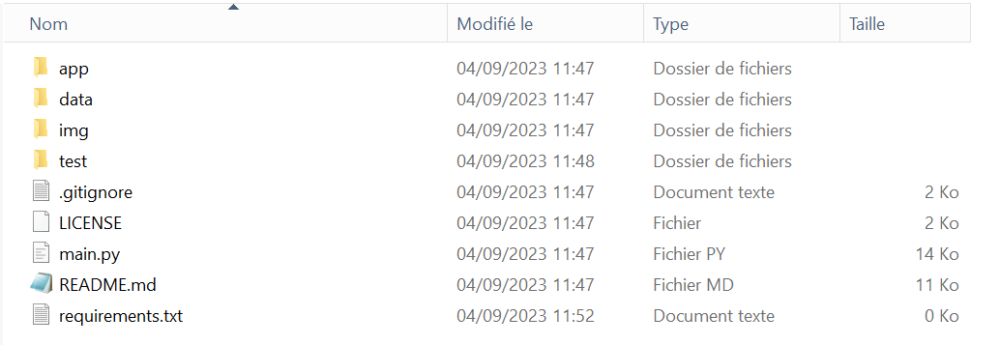

---
layout:
  title:
    visible: true
  description:
    visible: true
  tableOfContents:
    visible: true
  outline:
    visible: true
  pagination:
    visible: false
---

# 👩🏫 Les fichiers à créer en R et en Python

## Structurer son arbre de fichiers et son code

Lors d’un projet utilisant du code, pour la statistique ou l’informatique, il est important de structurer et d’organiser son code. Cela permet de le maintenir dans le temps, cela simplifie la recherche d’erreurs et sur le long terme, cela permet de le réutiliser.

Sauf dans certains cas spécifiques (petit projet, processus unique qui n’est pas amené à être reproduit), on essaye toujours d’éviter l’architecture qui concentre l’ensemble du code dans un seul fichier.

De même, on privilégie presque systématiquement le découpage d’une tâche complexe et longue en plusieurs fonctions de taille inférieure. C’est la programmation fonctionnelle. On va chercher à tirer profit au maximum des fonctions de R et Python, afin de gagner en temps et en clarté.

### Les fichiers à créer lors d’un nouveau projet python

D’abord, on commence par créer un fichier requirements.txt. Ce fichier permet de noter l’ensemble des librairies dont notre projet a besoin. Il nous sera très utile par la suite, car il permettra à un autre collaborateur de notre bulle projet de créer un environnement à l'identique du nôtre (voir [Travail collaboratif](../4\_collaborate/)). On le remplira dans le chapitre [gérer les paquets](../2\_packages/), il restera vide pour l’instant.

Ensuite, créons un fichier main.py. Ce fichier sera le seul point d’entrée dans notre programme. Il doit rester très court et son rôle est uniquement d’appeler les différents modules et fonctions de notre programme. Le vrai code métier n’y figure jamais.

Enfin, on peut créer des sous dossiers et fichiers selon nos besoins :

* Un dossier app: on y concentrera nos fichiers Python contenant le «vrai» code.
* Un dossier test: il contiendra les fichiers de tests de nos fonctions
* Un dossier resources: il peut contenir les fichiers images, des données nécessaires au programme, etc
* Un fichier readme.md: il contient les instructions pour lancer le programme
* Un fichier License contenant la licence du programme (open-source, tous droits réservés …)
* Un fichier .gitignore pour retirer du visionnage certains fichiers indésirables

Ces éléments ne sont en général pas nécessaires pour faire fonctionner le code, mais ils rendent le développement vraiment plus simple, d’où le fait que peu de projets s’en passent aujourd’hui. Voici un exemple d’architecture :

<figure><figcaption>
Les ressources d'un projet Python doivent être bien organisées
</figcaption></figure>

Ici le dossier ressource est séparé entre un dossier data et un dossier img.

Il existe bien sûr d’autres façons d’organiser son code, mais le principe de séparation du code et de son contexte s’applique en général dans les projets informatiques. En effet, le répertoire ci-dessus peut contenir toutes sortes de fichiers en plus : fichiers de paquets, fichiers d’environnement, etc. C’est pour cela qu’il ne faut pas y mélanger le code source qui est rangé dans le répertoire app.

### Les fichiers à créer lors d’un nouveau projet R

Un projet R peut tout à fait bénéficier d’une architecture aussi solide que celle d’une application python. Par exemple, le package [shinygouv](https://github.com/spyrales/shinygouv) permet de réaliser des applications au style bien connu de l’état, avec le langage R. Ce package utilise (entre autres) une licence, des tests, un dossier contenant les codes sources, un fichier Readme, et un fichier app.R. Il a donc une architecture très proche de celle que nous avons vue pour les projets Python.

## Les ressources pour aller plus loin :

* [Structurer votre projet](https://python-guide-pt-br.readthedocs.io/fr/latest/writing/structure.html) du Hitchhiker's guide to Python permet d'approfondir les notions et d'adopter des bonnes pratiques.
* [Organiser ses scripts](https://juba.github.io/tidyverse/05-organiser.html) du guide introduction à R et au tidyverse de Julien Barnier pour comprendre la structure projet en R.
