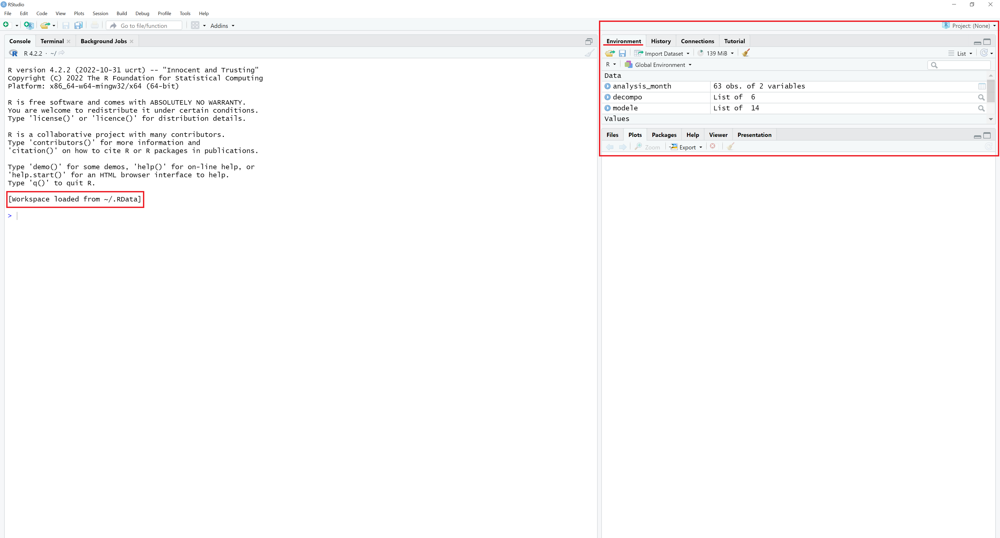

# 📊 RStudio

### Rstudio

> _Quelle différence entre R et Rstudio ?_\
> \
> R est un langage de programmation, mais également un logiciel libre capable d'éxecuter du code R. Il ne faut pas le confondre avec RStudio. Il s'agit d'un éditeur de code dédié au langage R. Il propose de visualiser ce que la session R possède en mémoire, de colorer votre code R ou encore de créer et gérer vos projets R. Il est tout à fait possible de faire du R sans Rstudio.

Rstudio est l'environnement de développement pour R le plus populaire. Il possède l'avantage d'être optimisé pour ce langage, il ne nécessite que très peu de configuration avant d'être fonctionnel.

<figure><figcaption>
RStudio permet d'éditer du code R
</figcaption></figure>

La création d'un projet peut se faire comme suit :

1. **Langue :** Vous pouvez utiliser RStudio en langue française même si ce n'est pas recommandé, car la fonction est encore expérimentale. Pour cela, rendez-vous dans Tools > Global options > General > Advanced et changez le paramètre User Interface Language.
2. **Création du projet**: File (Fichier) > New Project (Nouveau projet). Selon l'existence ou non de code préalable, choisissez entre les différentes options proposées. S'il s'agit d'un nouveau projet, dans un nouveau répertoire, vous pouvez sélectionner R package et ainsi obtenir un répertoire initialisé avec des fichiers de base.

Différents fichiers sont traditionnellement associés à un projet R, et créés lors d'un projet par RStudio :

* .RProfile
* .RData : la mémoire de la dernière session qui est chargée par défaut
* .Rhistory : l'historique des commandes exécutées qui est chargé dans le panneau Historique de RStudio

## Que faire si le démarrage de RStudio est lent ?

Les causes d'un démarrage lent de RStudio sont presque systématiquement liés aux tâches que RStudio effectue au démarrage. En effet, par défaut, RStudio charge le fichier .RData de votre projet, il charge les anciens documents ouverts, restaure l'historique, définit le dossier par défaut, etc. Cependant, souvent, la tâche la plus consommatrice est le chargement du fichier .RData. Par conséquent, il est important de vérifier son contenu et d'analyser les ressources consommées avec le gestionnaire des tâches. Il est possible de supprimer le fichier .Rdata de votre dossier si vous ne vous en servez pas. Autrement, il est possible d'effectuer un vidage de la mémoire de certains objets R avant la fermeture de celui-ci. De sorte, le fichier RData, qui est l'écriture sur disque des objets mémoire à la fermeture de la session, sera moins important en taille et prendra moins de temps à charger.

<figure><figcaption>
Je viens d'ouvrir mon RStudio, pourtant des éléments sont déjà chargés : ils ont été chargés au démarrage !
</figcaption></figure>
