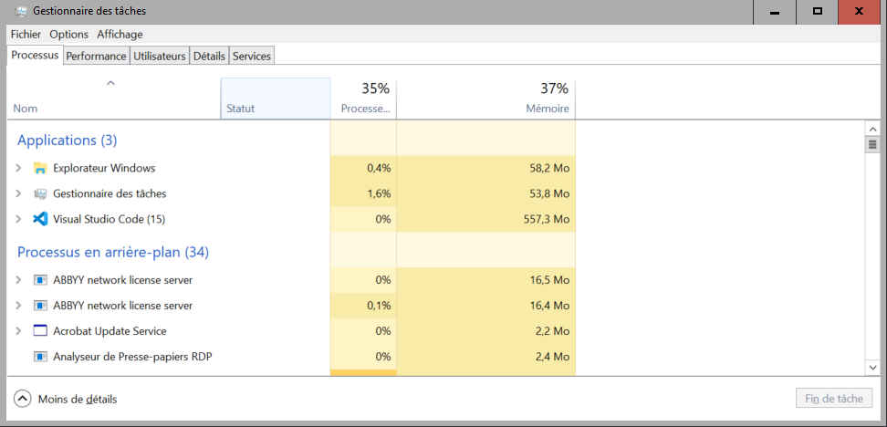

---
layout:
  title:
    visible: true
  description:
    visible: true
  tableOfContents:
    visible: true
  outline:
    visible: true
  pagination:
    visible: false
---

# 📉 Utiliser le gestionnaire des tâches

## Comment savoir quelles ressources sont consommées ?&#x20;

Windows fournit un outil dédié nommé le gestionnaire des tâches. Celui-ci est disponible dans les bulles CASD en tapant 'Gestionnaire des tâches' dans la barre de recherche Windows. L'utilisation de celui-ci est fortement recommandée puisqu'il permet de suivre la consommation en mémoire et en processeur en temps réel via l'onglet 'performance'.

<figure><figcaption>
Explorer les tâches ouvertes avec Windows permet de connaître l'utilisation des ressources
</figcaption></figure>

<figure><figcaption>
On peut aussi observer la consommation de tous les utilisateurs de la bulle, afin d'identifier qui consomme quoi
</figcaption></figure>

## Comment obtenir une configuration de niveau supérieure si j'ai identifié ce besoin ?

Le CASD peut vous proposer une augmentation temporaire ou permanente de vos ressources afin d'effectuer vos calculs. Pour cela, il est recommandé de prendre contact à l'adresse service@casd.eu. Vous pourrez alors exprimer votre besoin et un expert pourra évaluer avec vous la configuration la plus adaptée selon votre besoin et vos moyens. Avant cette opération, il peut être intéressant d'essayer d'optimiser son code comme nous allons le faire dans l'étape suivante : cela peut permettre d'effectuer votre calcul à configuration constante, et donc, d'effectuer des économies.
