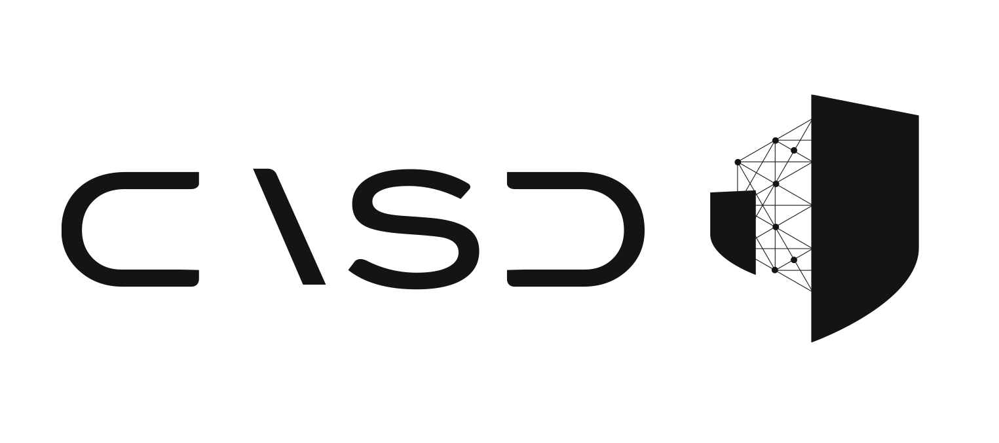

---
layout:
  title:
    visible: true
  description:
    visible: true
  tableOfContents:
    visible: true
  outline:
    visible: true
  pagination:
    visible: false
---

# 🎉 Bienvenue !

<figure><picture><source srcset=".gitbook/assets/Logo_casd_et_symbole_blanc.png" media="(prefers-color-scheme: dark)"></picture><figcaption></figcaption></figure>

Vous êtes habilité ou en cours d’habilitation pour travailler sur des données confidentielles auxquelles vous accéderez depuis le Centre d’Accès Sécurisé aux Données (CASD). Vous souhaitez travailler sur ces données avec le logiciel R, Python ou même Spark. Ce guide présente des conseils pour la réalisation de vos projets faisant intervenir ces langages ainsi que sur l’utilisation des outils de gestion de projets dans un contexte sans internet.

## Comment fonctionne cette documentation ?

Afin de simplifier la recherche des articles, des pictogrammes permettent de repérer facilement le type d'article dans une section :&#x20;

:woman\_teacher:     L'ensemble des articles qui présentent des notions théoriques sont repérables par la professeure.  Si une notion ne vous évoque rien avant les articles pratiques sur le sujet, vous pouvez bénéficier d'un cours express avec des ressources pour aller plus loin. Elle ne fera pas de vous un informaticien, en revanche, elle peut vous aider à mieux comprendre les commandes que vous allez appliquer.

:bar\_chart:    Ce graphique permet de repérer les articles qui présentent les aspects pratiques autour de R au CASD.

:snake:    Ce serpent permet de repérer les articles qui présentent la pratique de Python au CASD.

D'autres articles non spécifiques à ces langages sont présents : en particulier les notions autour de Spark ou du travail à plusieurs.

## Besoin d'aide supplémentaire ?

En cas de problèmes, questions sur ce guide, idées pour l’améliorer, n’hésitez pas à me contacter à [titouan.rigaud@casd.eu](mailto:titouan.rigaud@casd.eu). Je serais ravi d’échanger avec vous et de vous aider à résoudre vos problèmes avec les autres membres de l'équipe.

Au nom de l'équipe informatique : \
Bon code !&#x20;

En espérant que cette documentation vous soit le plus utile possible :v:
