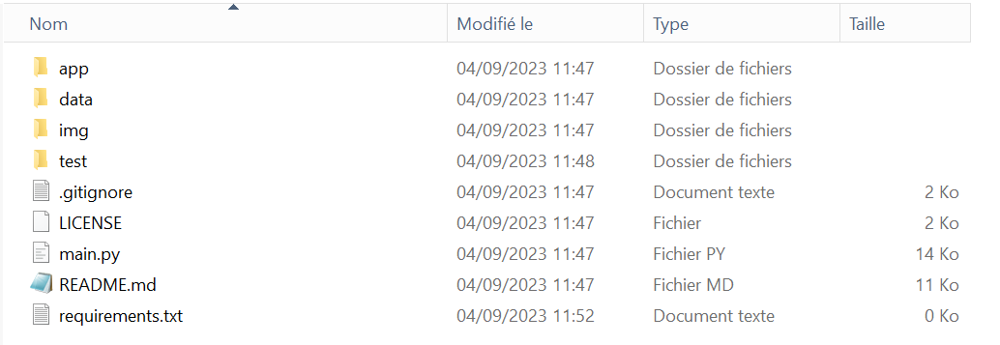

# 📂 Organiser et gérer son projet

## Python : Gérer son environnement de travail avec conda

> _Qu'est-ce qu'un environnement python?_

> C'est un espace dans lequel se trouve une version de l'interpréteur python (3.8, 3.9, ...) ainsi qu'un certain nombre de librairies Python, compatibles dans une certaine version (Numpy, Pandas, Matplotlib ...)

Conda est un outil très puissant: il permet de créer et gérer vos environnements Python pour chacune de vos applications. Ainsi, pas de mélange entre les dépendances et les versions entre vos différents projets (c’est ce que l’on appelle un conflit). Vous aurez également la possibilité d’exécuter votre code sur différentes machines avec beaucoup plus de simplicités (les environnements sont dits ‘reproductibles’). Cette section présente les rudiments de la gestion d’un environnement conda, mais vous trouverez dans les fiches suivantes les bonnes pratiques concernant les dépendances, qui apportent la véritable valeur ajoutée de l’outil conda.

### Création de l’environnement

D’abord nous allons créer un environnement nommé projet\_1 pour votre projet, en version 3.9 dans cet exemple. Il est recommandé de créer un environnement par projet, afin que chaque environnement soit isolé, il n’y aura ainsi pas de conflits:

Ouvrez le dossier raccourcis présents sur le bureau de votre SD-Box une fois connecté à votre session. Vous y trouverez un raccourci vers Minconda Prompt. Il s'agit tout simplement d'un terminal de commande où Anaconda est accessible:

```bash
conda create --name projet_1 python --offline
```

Cette commande utilise anaconda (conda) afin de créer un environnement (create), le nommer projet\_1 (option name) et demander l'installation de python (option python). Enfin, nous sommes dans un environnement sans internet d'où le paramètre --offline.

**Attention :** Python2 ainsi que les versions antérieures à la version 3.8 ne sont pas disponibles sur le CASD. Il est déconseillé d'utiliser ces versions même en dehors car peu de librairies modernes acceptent encore de travailler dans ces versions de Python.

Pour choisir une version de python spécifique, il suffit d'exécuter la commande présentée ci-dessus dans le terminal ouvert par miniconda dont le nom correspond. Par exemple, pour obtenir un environnement python 3.10, il suffit d'ouvrir le miniconda prompt 3.10 et d'exécuter le conda create.

### Activation de l’environnement

> _A quoi sert l'activation?_

> C'est le fait de préciser avec quel environnement on souhaite travailler. Cela permet de changer de l'environnement de base vers votre environnement spécifique pour le projet.

Maintenant, activons l’environnement afin de travailler dedans:

```bash
conda activate projet_1
```

**Attention:** Il faudra activer votre environnement avant l’exécution de votre code python ou d’effectuer des manipulations d’installation. Certains outils, tel que des environnements de développements, automatisent cette étape, mais ce n’est pas systématique. Les environnements de développements seront présentés dans une autre fiche.

Les autres commandes associées au système conda sont résumées dans [cette fiche](https://docs.conda.io/projects/conda/en/4.6.0/\_downloads/52a95608c49671267e40c689e0bc00ca/conda-cheatsheet.pdf).

> _Mon environnement est créé, mais je ne le retrouve pas dans VSCode. Que faire ?_

> Pour utiliser VSCode avec votre environnement, il faut avoir installé les extensions liées à Python (voir chapitre : Développer votre application à la [section VSCode](3\_code.md#vscode)) . Ensuite, utilisez ctrl + maj + p afin de séléctionner l'environnement Python ainsi créé et l'ajouter à VSCode.

## Structurer son arbre de fichiers et son code

Lors d’un projet utilisant du code, pour la statistique ou l’informatique, il est important de structurer et d’organiser son code. Cela permet de le maintenir dans le temps, cela simplifie la recherche d’erreurs et sur le long terme, cela permet de le réutiliser.

Sauf dans certains cas spécifiques (petit projet, processus unique qui n’est pas amené à être reproduit), on essaye toujours d’éviter l’architecture qui concentre l’ensemble du code dans un seul fichier.

De même, on privilégie presque systématiquement le découpage d’une tâche complexe et longue en plusieurs fonctions de taille inférieure. C’est la programmation fonctionnelle. On va chercher à tirer profit au maximum des fonctions de R et Python, afin de gagner en temps et en clarté.

### Les fichiers à créer lors d’un nouveau projet python

D’abord, on commence par créer un fichier requirements.txt. Ce fichier permet de noter l’ensemble des librairies dont notre projet a besoin. Il nous sera très utile par la suite car il permettra à un autre collaborateur de notre bulle projet de créer un environnement à l'identique du nôtre (voir [Travail collaboratif](4\_collaborate.md)). On le remplira dans le chapitre [gérer les paquets](2\_packages.md), il restera vide pour l’instant.

Ensuite, créons un fichier main.py. Ce fichier sera le seul point d’entrée dans notre programme. Il doit rester très court et son rôle est uniquement d’appeler les différents modules et fonctions de notre programme. Le vrai code métier n’y figure jamais.

Enfin, on peut créer des sous dossiers et fichiers selon nos besoins:

* Un dossier app: on y concentrera nos fichiers Python contenant le «vrai» code.
* Un dossier test: il contiendra les fichiers de tests de nos fonctions
* Un dossier resources: il peut contenir les fichiers images, des données nécessaires au programme, etc
* Un fichier readme.md: il contient les instructions pour lancer le programme
* Un fichier License contenant la licence du programme (open-source, tous droits réservés …)
* Un fichier .gitignore pour retirer du visionnage certains fichiers indésirables

Ces éléments ne sont en général pas nécessaires pour faire fonctionner le code, mais ils rendent le développement vraiment plus simple, d’où le fait que peu de projets s’en passent aujourd’hui. Voici un exemple d’architecture:

<figure><figcaption><p>Les ressources d'un projet Python doivent être bien organisées</p></figcaption></figure>

Ici le dossier ressources est séparé entre un dossier data et un dossier img.

Il existe bien sûr d’autres façons d’organiser son code, mais le principe de séparation du code et de son contexte s’applique en général dans les projets informatiques. En effet, le répertoire ci-dessus peut contenir toutes sortes de fichiers en plus: fichiers de paquets, fichiers d’environnement, etc. C’est pour cela qu’il ne faut pas y mélanger le code source qui est rangé dans le répertoire app.

### Les fichiers à créer lors d’un nouveau projet R

Un projet R peut tout à fait bénéficier d’une architecture aussi solide que celle d’une application python. Par exemple, le package [shinygouv](https://github.com/spyrales/shinygouv) permet de réaliser des applications au style bien connu de l’état, avec le langage R. Ce package utilise (entre autre) une licence, des tests, un dossier contenant les codes sources, un fichier Readme, et un fichier app.R. Il a donc une architecture très proche de celle que nous avons vu pour les projets Python.
