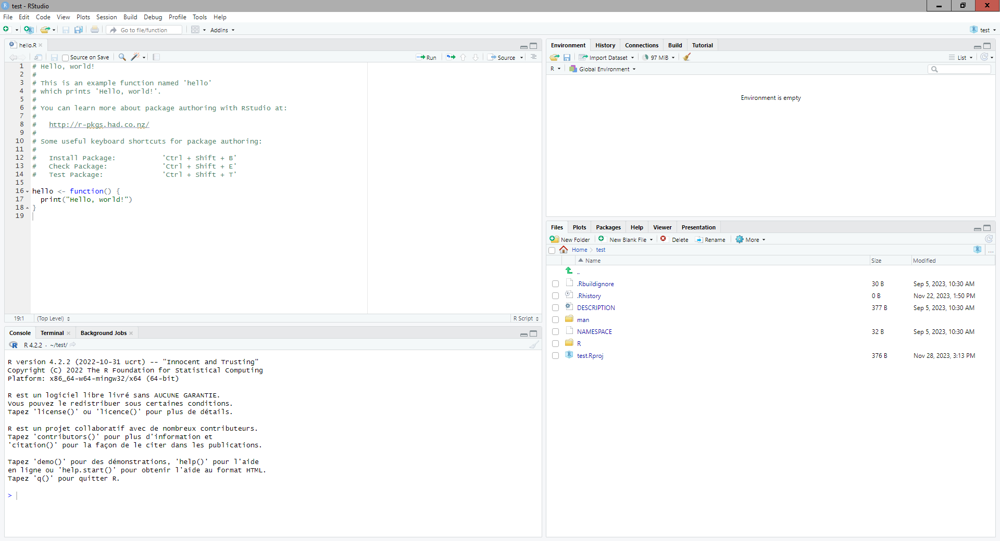
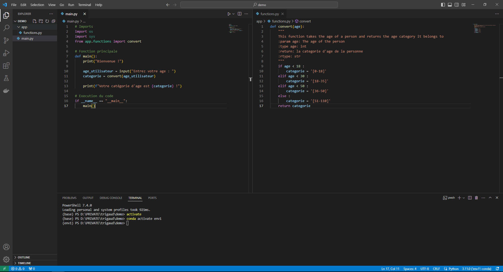

# 💻 Développer votre application!

## Un éditeur de code

L'éditeur de code est un outil de développement qui facilite la rédaction de code. Il peut proposer des options pour enregistrer automatiquement les modifications, mettre en forme le code de façon automatisée ou même effectuer de la coloration syntaxique selon le langage. Des fonctions avancées permettent même l'autocomplétion du code, la remontée d'alerte en cas d'incohérence de type… Les fonctions proposées par les IDE (Environnement de Développement Intégré) et leurs extensions sont quasiment infinies.

### Rstudio

> _Quelle différence entre R et Rstudio ?_

> R est un langage de programmation, mais également un logiciel libre capable d'éxecuter du code R. Il ne faut pas le confondre avec RStudio. Il s'agit d'un éditeur de code dédié au langage R. Il propose de visualiser ce que la session R possède en mémoire, de colorer votre code R ou encore de créer et gérer vos projets R. Il est tout à fait possible de faire du R sans Rstudio.

Rstudio est l'environnement de développement pour R le plus populaire. Il possède l'avantage d'être optimisé pour ce langage, il ne nécessite que très peu de configuration avant d'être fonctionnel.

<figure><figcaption><p>RStudio permet d'éditer du code R</p></figcaption></figure>

La création d'un projet peut se faire comme suit :

1. **Langue :** Vous pouvez utiliser RStudio en langue française même si ce n'est pas recommandé, car la fonction est encore expérimentale. Pour cela, rendez-vous dans Tools > Global options > General > Advanced et changez le paramètre User Interface Language.
2. **Création du projet**: File (Fichier) > New Project (Nouveau projet). Selon l'existence ou non de code préalable, choisissez entre les différentes options proposées. S'il s'agit d'un nouveau projet, dans un nouveau répertoire, vous pouvez sélectionner R package et ainsi obtenir un répertoire initialisé avec des fichiers de base.

Différents fichiers sont traditionnellement associés à un projet R, et créés lors d'un projet par RStudio :

* .RProfile
* .RData : la mémoire de la dernière session qui est chargée par défaut
* .Rhistory : l'historique des commandes exécutées qui est chargé dans le panneau Historique de RStudio

> _Que faire si le démarrage de RStudio est lent ?_

> Les causes d'un démarrage lent de RStudio sont presque systématiquement liés aux tâches que RStudio effectue au démarrage. En effet, par défaut, RStudio charge le fichier .RData de votre projet, il charge les anciens documents ouverts, restore l'historique, définit le dossier par défaut, etc. Cependant, souvent, la tâche la plus consommatrice est le chargement du fichier .RData. Par conséquent, il est important de vérifier son contenu et d'analyser les ressources consommées avec le gestionnaire des tâches. Il est possible de supprimer le fichier .Rdata de votre dossier si vous ne vous en servez pas. Autrement, il est possible d'effectuer un vidage de la mémoire de certains objets R avant la fermeture de celui-ci. De sorte, le fichier RData, qui est l'écriture sur disque des objets mémoire à la fermeture de la session, sera moins important en taille et prendra moins de temps à charger.

### VScode

VScode est l'environnement de développement le plus populaire au monde. Il permet pratiquement de coder avec tout langage de programmation. Cependant, l'utiliser nécessite une configuration plus importante du fait qu'il est très généraliste. Faisons un tour d'horizons de certaines fonctions utiles :

1. **Langue :** VScode est utilisable en langue française en utilisant la touche F1, et en saisissant `Configure Display Language`
2. **Syntaxe :** La coloration syntaxique avancée et l'indentation automatique sont activées par défaut.
3. **Enregistrement et formatage automatique** : Vous pouvez demander à VSCode d'enregistrer le code pour vous en ouvrant les paramètres dans fichiers > préférences > paramètres. Recherchez le paramètre Auto-save. De plus, VSCode peut formatter le fichier à chaque enregistrement de celui-ci à l'aide du paramètre Format On Save.
4. **Git intégré** : VSCode est livré avec une intégration Git native, cette interface peut être plus simple d'utilisation que le terminal. Pour l'utiliser, le bouton se situe dans la colonne de gauche et se nomme Contrôle de code source.
5. **IntelliSense**: Il s'agit du système d'auto-complétion pour Python.
6. **Débuggeur intégré**: À l'aide des points d'arrêt dans le code, vous pouvez suivre l'exécution à l'aide du mode debug. Vous pourrez visualiser l'évolution des variables. Le mode débug de VSCode se situe juste en dessous de l'intégration git dans la colonne de gauche.
7. **Terminal intégré :** VSCode propose un terminal intégré qui vous permet d'exécuter des commandes Python et d'autres tâches sans quitter l'éditeur. Pour cela, utilisez le menu terminal.
8. **Linter intégré :** Les linters tels que Pylint peuvent être intégrés pour identifier et corriger les erreurs de style de code et les problèmes potentiels.

<figure><figcaption><p>VScode est un éditeur de code généraliste</p></figcaption></figure>

Vous pouvez installer de nombreuses extensions VSCode dans la bulle. Pour cela, voici la procédure :

* Dans VSCode, appuyez sur Ctrl+Shift+X pour ouvrir le menu extensions
* Dans les ... de ce menu, cliquez sur 'installer depuis VSIX'.
* Choissisez un fichier VSIX correspond à l'extension que vous souhaitez installer dans le dossier C:\Users\Public\Documents\VSCodeExtension

Deux extensions sont particulièrement recommandées : ms-python.python et ms-tollsai.jupyter.

## Le code

### Un exemple d'application Python simple

En règle générale, on cherche à maintenir le fichier principal d'une application python aussi succinct que possible. Un exemple de code permettant de renvoyer la tranche d'âge associée à un utilisateur pourrait être :

**functions:**

```python
def convert(age):
    """
    This function takes the age of a person and returns the age category it belongs to
    :param age: The age of the person
    :type age: int
    :return: la categorie d'age de la personne
    :rtype: str
    """
    if age < 18 :
        categorie = '[0-18]'
    elif age < 30 :
        categorie = '[18-35]'
    elif age < 50 :
        categorie = '[36-50]'
    else :
        categorie = '[51-110]'
    return categorie
```

**main :**

```python
# Imports
import os
import sys
from app.functions import convert

# Fonction principale
def main():
    print("Bienvenue !")

    age_utilisateur = input("Entrez votre age : ")
    categorie = convert(age_utilisateur)

    print(f"Votre catégorie d'age est {categorie} !")

# Execution du code
if __name__ == "__main__":
    main()
```

Dans cet exemple, j'ai mis les imports en en-têtes de fichiers, puis, j'ai défini la fonction principale de mon programme, qui exécute du code métier contenu dans un autre fichier, dans une fonction. Enfin, j'exécute ma fonction principale à l'aide de l'instruction `if __name__ = "__main__".`

**Conseil :** Tant que possible, il faut essayer d'appliquer les principes recommandés par le standard [PEP8](https://peps.python.org/pep-0008/) (Python Enhancement Proposals) qui définit le style de code applicable au code Python. Cela permet un code plus lisible et de meilleur qualité.

> _Docstring / Commentaires ?_
>
> Lorsque vous produisez le code, il est important de le documenter. Cependant, il n'existe pas une seule manière de faire cette documentation. Le docstring est la norme python pour documenter ce que fait une fonction (c'est le Quoi). Cela sert avant tout aux utilisateurs de votre code ainsi qu'aux développeurs. On retrouve cette documentation sous la fonction.
>
> Cependant, il est aussi important de documenter le Comment. C'est ce qui permet à un autre développeur de modifier votre code et d'assurer sa maintenabilité. Cela peut être fait à l'aide des commentaires dans le code. Cela ne remplace pas le fait d'avoir un code lisible (nom de variables parlants, conditions claires), mais cela permet de savoir ce que le code est en train d'effectuer. Il faut trouver le compromis entre trop de commentaires, et un code sans commentaire qui est illisible.

### Un exemple d'application R simple

Voici un autre exemple en R utilisant la librairie Shiny. Elle permet de faire une interface graphique simple. Ici, je n'ai pas séparé le code en plusieurs fichiers. Cependant, on pourrait tout à fait définir une interface graphique plus complète dans un autre module, et l'importer dans ce fichier app.R.

```r
# Imports
library(shiny)

# Fenetre principale de l'application
ui <- fluidPage(
    headerPanel("Mon Application Shiny"),
    textInput("nom_utilisateur",  "Entrez votre nom :",  ""),
    actionButton("bouton_soumettre",  "Soumettre"),
    verbatimTextOutput("message_bienvenue")
)

# Définition de la logique métier
server <-  function(input, output)  {
    output$message_bienvenue <- renderText({
        if  (!is.null(input$nom_utilisateur)) {
            paste("Bonjour,", input$nom_utilisateur,  "!")
        }
    })
}

# Execution
shinyApp(ui, server)
```

<figure><figcaption><p>Le résultat de notre application</p></figcaption></figure>
