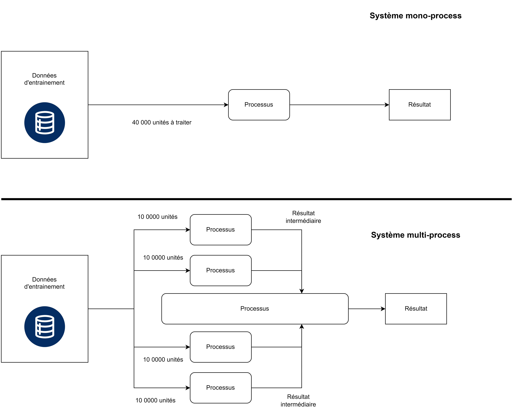

# Optimiser les performances

## Gestion des ressources

> _Qu'est ce que les ressources?_

> Il s'agit de la configuration matérielle associée à votre projet. C'est-à-dire, le niveau de puissance du matériel fourni. Il doit être adapté aux traitements que vous allez effectuer. Par exemple, une régression linéaire sur 30 000 individus peut tout à fait être réalisé avec une configuration minimale. Mais ce n'est pas le cas de l'entrainement d'un modèle d'intelligence artificielle sur des centaines de milliers de lignes. Par ressources, au CASD, on entend le processeur et ses cœurs, la mémoire vive (RAM) ainsi que la mémoire sur disque (HDD/SSD).

Le processeur possède deux caractéristiques qui nous intéressent particulièrement pour le calcul:

- Sa fréquence: elle peut grossièrement être considérée comme proportionnelle au nombre d'opérations par secondes. Une fréquence plus élevée est en général synonyme de temps de traitements plus courts.
- Son nombre de cœurs: C'est le nombre de traitements que le processeur peut effectuer en même temps. Il s'agit d'un élément fondamental pour le multi-tâches ainsi que les calculs parallèles.

Il est très important de bien comprendre le comportement de votre logiciel, et son utilisation des cœurs. En effet, si un processus est mono-coeur, peu importe le reste de la configuration (mémoire en particulier), une augmentation forte du nombre d'observations augmentera très fortement le temps de calcul ! Nous verrons dans la section suivante comment optimiser le code par le parallélisme.

Le deuxième élément clé qui détermine la performance d'un calcul (hormis le processeur) est la mémoire vive (aussi appelée RAM). Cette mémoire est un stockage de taille modérée mais très performante. Elle permet de stocker des résultats de calculs intermédiaires, mais aussi certaines données utiles au calcul que le processeur réutilisera par la suite. On peut donc s'en servir pour accélérer nos calculs, car écrire chaque résultat intermédiaire sur disque est très long. C'est une opération qui est dite 'couteuse'. Ecrire et lire les informations stockées dans la RAM est bien moins couteux. Cependant, la place est plus limitée.

En effet, en chargeant des données lues à de multiples reprises dans la mémoire RAM, on économise ainsi le temps de lecture sur disque. Cela peut représenter un gain de temps très important selon les applications. Cette utilisation n'est pas la même selon les logiciels. Par exemple, R utilise massivement la mémoire, ce qui peut causer des erreurs puisque celui-ci n'inclue pas de mécanisme de nettoyage nativement. A la différence de Python, qui vide automatiquement la mémoire, R impose de faire attention aux chargements que l'on effectue et de vider manuellement la mémoire. Nous verrons également ceci dans la section suivante.

> _Comment savoir quelles ressources sont consommées?_

> Windows fournit un outil dédié nommé le gestionnaire des tâches. Celui-ci est disponible dans les bulles CASD en tapant 'Gestionnaire des tâches' dans la barre de recherche Windows. L'utilisation de celui-ci est fortement recommandée puisqu'il permet de suivre la consommation en mémoire et en processeur en temps réel via l'onglet 'performance'.

> _Comment obtenir une configuration de niveau supérieure si j'ai identifié ce besoin?_

> Le CASD peut vous proposer une augmentation temporaire ou permanente de vos ressources afin d'effectuer vos calculs. Pour cela, il est recommandé de prendre contact à l'adresse service@casd.eu. Vous pourrez alors exprimer votre besoin et un expert pourra évaluer avec vous la configuration la plus adaptée selon votre besoin et vos moyens. Avant cette opération, il peut être intéressant d'essayer d'optimiser son code comme nous allons le faire dans l'étape suivante : cela peut permettre d'effectuer votre calcul à configuration constante, et donc, d'effectuer des économies.

**Attention:** Les ressources sur lesquelles travaillent les différents utilisateurs de votre projet sont communes ! Cela signifie que la mémoire est partagée, ainsi que le processeur. À l'aide du gestionnaire des tâches de Windows, il est possible d'évaluer les ressources consommées par chaque utilisateur en temps réel dans l'onglet 'utilisateurs'. Il permet également de savoir quels utilisateurs sont connectés.

## Optimiser son code pour réduire le temps de calcul

Il existe de nombreuses manières de réduire son temps de calcul, il faut en particulier s'intéresser à la complexité des algorithmes que l'on met en place. Cependant, un calcul de complexité peut se révéler difficile à mener, surtout si on ne connait pas l'algorithme utilisé en détail. Des ressources sont disponibles sur internet pour apprendre à mener ce type de calculs. Voici deux autres éléments importants dans la gestion des ressources lorsque l'on code et qui sont plus simples à mettre en place.

### Vider la mémoire avec R

R effectue une utilisation intensive des ressources mémoires. En particulier, toute instruction de type:

```r
read.csv()
```

charge les données du fichier dans la mémoire. Faire plusieurs chargements identiques ou avoir plusieurs tables intermédiaires chargées dans la mémoire de R peut amener à une saturation. Par conséquent, nous devons vider cette mémoire des objets inutiles. Dans Rstudio, l'onglet qui permet de voir ce qui est chargé dans la mémoire se situe en haut à droite, dans la fenêtre "Environnement". On y retrouve tous les objets chargés dans la mémoire, et qui sont accessibles par un appel dans la console par exemple.

On peut vider un objet spécifiquement avec la commande:

```r
rm(nom_objet)
```

Aussi, il est possible de vider l'ensemble des éléments avec la commande:

```r
rm(list=ls())
```

C'est ce qu'il est recommandé de faire lorsque vous souhaitez recommencer l'exécution d'un programme à 0. Dernière précision: R charge parfois la dernière session via le fichier Rdata. Il n'est donc non seulement pas recommandé de sortir un fichier Rdata, mais cela signifie également que la fermeture de R ne vous garantie pas de repartir avec un environnement R vierge.

### Paralléliser un calcul avec Python

Le calcul utilisant plusieurs cœurs est possible en Python et en R. Un certains nombres de traitements natifs ou accessibles via des paquets sont d'ailleurs naturellement parallélisés dans ces langages. Voici un exemple de calcul multi-coeurs utilisant des processus en Python. Il ne s'agit pas de la seule façon de faire. Le principe de fonctionnement est souvent identique:



Il s'agit de distribuer la charge de travail sur plusieurs cœurs/machines afin d'assurer une vitesse de calcul optimale plutôt que de faire faire les opérations par un seul cœur. En effet, on fait donc plusieurs calculs en même temps plutôt que les uns après les autres.

Généralement, un processus central est responsable d'invoquer les autres et de récupérer leurs résultats. De cette manière, on divise la charge des différents cœurs du nombre de cœurs utilisés pour les calculs.

**Attention:** L'ensemble des calculs ne se prêtent pas au calcul distribué, en particulier si les calculs à effectuer sur les différentes opérations sont fortement liés. Ce paradigme est particulièrement efficace et simple à mettre en place sur les traitements séquentiels indépendants.

```python
import multiprocessing

# Fonction qui sera exécutée dans chaque processus indépendant
def worker_function(worker_id, data):
    print(f"Worker {worker_id} traite {data}")
    # Vous pouvez insérer ici vos traitements

if __name__ == "__main__":
    # Données à traiter (peut être une liste, un dictionnaire, etc.)
    data_to_process = [1, 2, 3, 4, 5, 6, 7, 8, 9, 10]

    # Créer un pool de processus avec multiprocessing.Pool
    num_processes = 4  # Utilise 4 coeurs pour effectuer le traitement
    pool = multiprocessing.Pool(processes=num_processes)

    # Mapper la fonction de travail sur les données en parallèle
    # Chaque processus exécute la worker_function avec une partie des données
    results = []
    for i, data_chunk in enumerate(data_to_process):
        result = pool.apply_async(worker_function, (i, data_chunk))
        results.append(result)

    # Attendre la fin de tous les processus
    pool.close()
    pool.join()

    # Récupérer les résultats si nécessaire
    final_output = [result.get() for result in results]

    # Traitement final avec les résultats si nécessaire
    # ...

    print("Tous les processus sont terminés.")

```

Dans ce code, on exécute un traitement sur les données de façon parallèle avec 4 processus. On commence par définir le traitement que chaque processus va effectuer. Puis, la partie du code qui suite l'instruction `if __name__ == "__main__"` correspond au processus central sur le schéma précédent. Il commence par invoquer les autres processus. Puis, il leur assigne une tâche à effectuer et enregistre les résultats. Une fois ces traitements effectués, les processus sont terminés et on obtient le résultat final que l'on peut retraiter dans le processus central (ou non si ce n'est pas nécessaire).

**Attention:** Les ressources mémoires associées à chaque processus sont partagées dans cet exemple! Cela veut dire que l'utilisation massive de processus peut provoquer une saturation de la mémoire RAM. Chaque processus peut être amené à utiliser des ressources mémoires dans son traitement, et donc augmenter fortement la consommation par rapport à un traitement mono-processeur.
