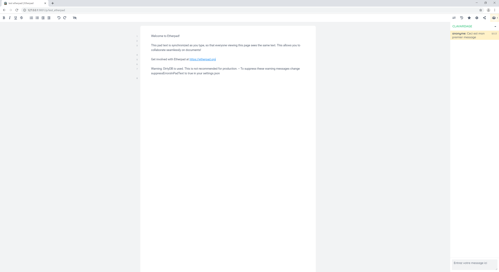

# 🌐 Communiquer dans la bulle

## Discuter et éditer un document commun avec Etherpad

Afin de pouvoir échanger directement dans la bulle, un chat écrit est disponible. Pour cela, voici la démarche à suivre :

* Un collaborateur doit lancer le script clavardage dans le dossier raccourci du bureau. Il se connecte ensuite sur 127.0.0.1:9001/ et crée un bloc note avec un nom.
* Chaque collaborateur se connecte sur 127.0.0.1:9001/p/nom\_du\_pad, tout le monde peut alors collaborer au document et clavarder via la colonne de droite. Cela permet d'échanger des informations de façon rapide en restant dans la bulle.

<figure><figcaption>
Ici, le document au centre peut être édité, et la colonne de droite permet de discuter
</figcaption></figure>

