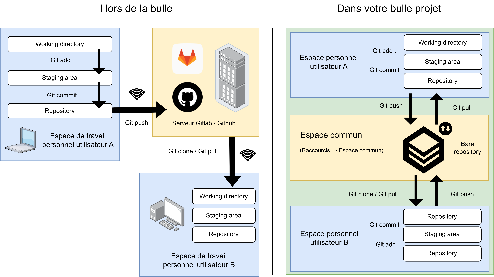
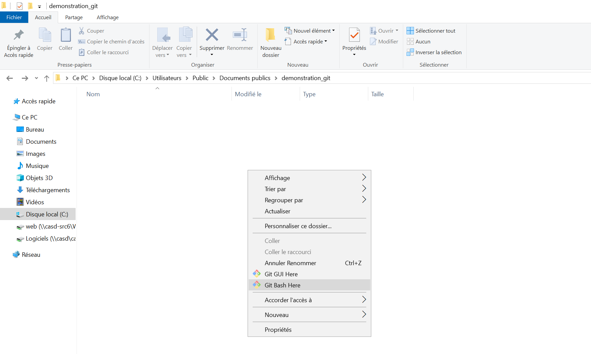
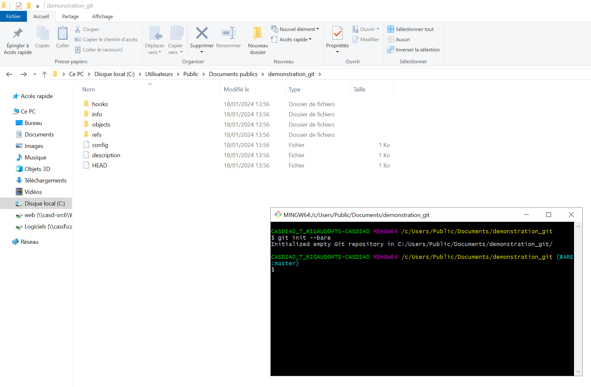

# ❤️ Git

## Gérer ses versions de code avec git

Git est le système de version de code (VCS) le plus connu. Il permet d’enregistrer les modifications apportées au code d’une application, rétablir une version en cas de problème. Ce logiciel possède beaucoup d’intérêt pour le travail collaboratif. À l’aide d’un système de synchronisation, il permet d’enregistrer son code sur un dépôt local et distant. Dans le cadre de travail individuel sur une session CASD, il présente un fort intérêt pour enregistrer les différentes versions de son code, que l'on travaille seul ou même à plusieurs. Cependant, il est impossible d’utiliser les fonctions distantes du logiciel dans les bulles CASD puisque internet n’est pas disponible. Git sera incapable de contacter un serveur distant et donc, aucune synchronisation vers un dépôt GitHub ou GitLab extérieur ne sera possible. Cependant, il est tout de même possible d'effectuer du travail collaboratif avec Git au CASD. Pour cela, il faut utiliser un bare repository.

<figure><figcaption><p>Utilisation de git en mode bare</p></figcaption></figure>

Un bare repository est un répertoire Git partagé qui sert de stockage distant. On l'installe généralement dans l'espace commun de telle sorte que tout le monde puisse le cloner et travailler dessus dans son espace local. Une fois satisfait des modifications, on peut alors effectuer la commande Git push afin d'envoyer sur le répertoire partagé l'ensemble des modifications qui ont été enregistrées dans Git. Les autres collaborateurs peuvent alors en disposer avec un Git pull. Sur le schéma, vous avez sur la gauche le fonctionnement traditionnel d'une architecture git avec un dépôt distant hébergé sur GitLab/GitHub. Sur la droite, le fonctionnement en mode multi-utilisateurs est expliqué dans une bulle projet. Pour mettre en place un tel système, la procédure et ses commandes sont expliquées dans la section suivante

**Conseil :** Réalisez des ajouts à la base de code (commande `git add .` et `git commit -m "nom du commit"`) aussi fréquemment que possible, avec des noms parlants. En cas d'apparition d'erreur, cela permettra de rechercher quelle est la modification qui a introduit l'erreur, au lieu de perdre l'ensemble des modifications apportées lors d'une nouvelle version. Une bonne pratique est : une modification pour ajouter une fonction ou corriger une erreur = un commit dans Git.

Une fiche récapitulative avec les principales fonctions du logiciel est disponible [ici](https://education.github.com/git-cheat-sheet-education.pdf)

### Mettre en place un bare repository Git

**Attention :** Git fait partie de la liste des logiciels présents par défaut au CASD mais votre espace projet peut avoir été créé avant. Si vous ne voyez pas Git Bash Here lorsque vous effectuez un clic droit dans l'explorateur de fichier, vous pouvez demander l'installation de git à service@casd.eu en précisant bien le nom de votre projet.&#x20;

D’abord, la personne initiant le dépôt va créer un répertoire bare dans l'espace commun. Pour effectuer cette manœuvre, rendez-vous avec votre explorateur de fichier dans C:\Utilisateurs\Public\Documents. Créez alors un dossier pour le projet. Toujours dans l'explorateur, rentrez dans le dossier et faites : clic droit, Git Bash here. Comme ceci :

<figure><figcaption></figcaption></figure>

Un terminal de commande devrait alors s'ouvrir, vous pouvez y saisir la commande suivante :

```bash
git init --bare
```

Le terminal devrait répondre : `Initialized empty git repository in C:/Users/Public/Documents/nom_de_votre_dossier/`. Cela devrait se présenter de la sorte :

<figure><figcaption></figcaption></figure>

&#x20;Cette adresse est maintenant celle du répertoire bare et vous pouvez fermer ce terminal. Le dépôt est créé pour l'ensemble des utilisateurs et utilisatrices du projet. Personne ne peut l'éditer directement : pour y apporter des modifications, il faut le cloner et utiliser les commandes git add . / git commit / git push. Pour cloner le dépôt, rendez-vous à la section suivante.

### Cloner un dépôt déjà existant

Rendez-vous désormais avec votre explorateur de fichiers dans votre espace personnel, à l'endroit où vous souhaitez cloner ce dépôt. Effectuez : clic droit, Git Bash Here. Dans le terminal, saisissez :

```bash
git clone C:/Users/Public/Documents/nom_du_dossier_à_cloner/
```

Vous pouvez à présent éditer votre dépôt, et envoyer vos modifications comme vous le feriez hors de la bulle.

### Ajouter des fichiers au dépôt

Créez un fichier supplémentaire dans le dossier contenant votre version du dépôt Git.

Effectuez de nouveau clic droit, git Bash Here dans ce dossier. Saisissez alors :&#x20;

```git
git add nouveau_fichier.txt
git commit -m "message de votre commit"
git push
```

### Récupérer les modifications d'un autre utilisateur

Effectuez clic droit, git Bash Here dans votre dossier contenant le code (votre version du dépôt git). Saisissez :&#x20;

```
git pull
```
