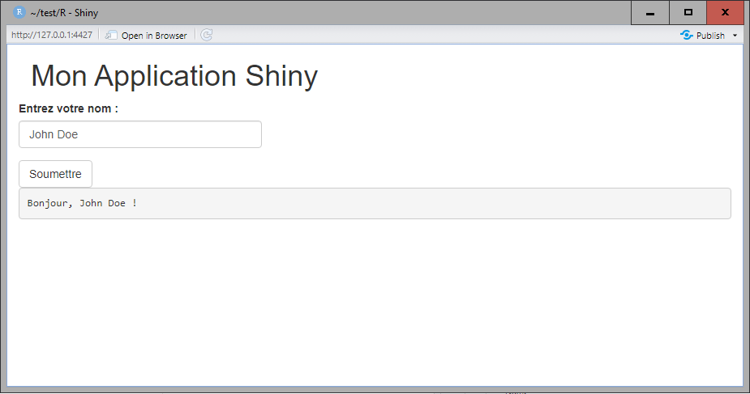

---
layout:
  title:
    visible: true
  description:
    visible: true
  tableOfContents:
    visible: true
  outline:
    visible: true
  pagination:
    visible: false
---

# 📊 Un exemple d'application R

### Un exemple d'application R simple

Voici un autre exemple en R utilisant la librairie Shiny. Elle permet de faire une interface graphique simple. Ici, je n'ai pas séparé le code en plusieurs fichiers. Cependant, on pourrait tout à fait définir une interface graphique plus complète dans un autre module, et l'importer dans ce fichier app.R.

```r
# Imports
library(shiny)

# Fenetre principale de l'application
ui <- fluidPage(
    headerPanel("Mon Application Shiny"),
    textInput("nom_utilisateur",  "Entrez votre nom :",  ""),
    actionButton("bouton_soumettre",  "Soumettre"),
    verbatimTextOutput("message_bienvenue")
)

# Définition de la logique métier
server <-  function(input, output)  {
    output$message_bienvenue <- renderText({
        if  (!is.null(input$nom_utilisateur)) {
            paste("Bonjour,", input$nom_utilisateur,  "!")
        }
    })
}

# Execution
shinyApp(ui, server)
```

<figure><figcaption><p>Le résultat de notre application</p></figcaption></figure>
