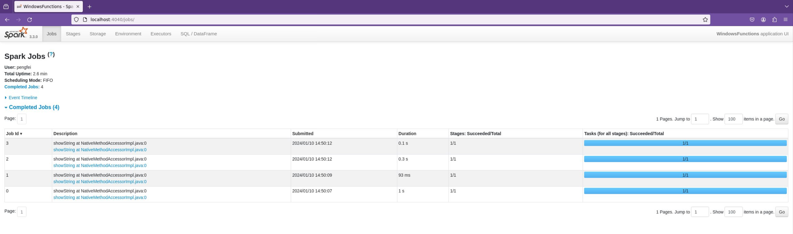
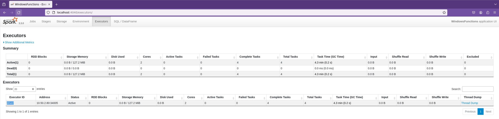
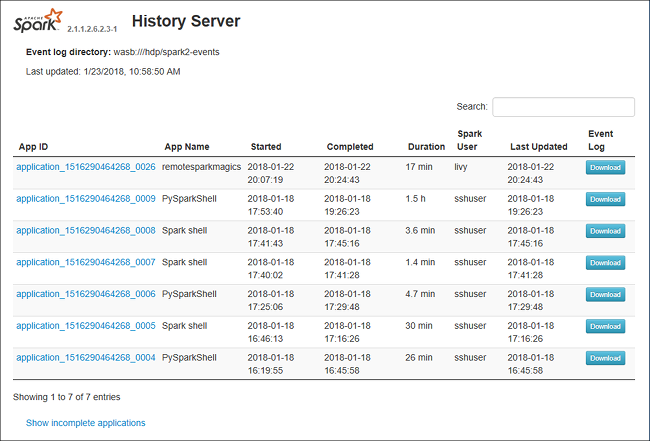

# 📺 Spark UI et Server History

## Spark UI

L'interface Spark UI vous permet d'observer les ressources consommées, les tâches en cours d'exécution, les utilisateurs connectés, etc. Cette interface est très pratique puisqu'elle permet de savoir avant de lancer une tâche quelles sont les ressources disponibles. Deux onglets nous intéressent particulièrement.

La page jobs, qui contient les tâches qui tournent actuellement :&#x20;

<figure><figcaption>
Différents jobs terminés
</figcaption></figure>

La page executors, qui contient la consommation des différents nœuds du cluster :&#x20;

<figure><figcaption>
Les machines sont au repos
</figcaption></figure>

L'adresse pour accéder au Spark UI n'est pas fixe parce que Spark sélectionne un port disponible en se décalant par rapport au port 4040 à chaque port déjà utilisé. Par conséquent, l'adresse devrait être proche de : http://localhost:4040. Cependant, il est préférable de chercher l'adresse précise dans les documents spécifiques à votre cluster dans l'espace commun de votre bulle.

Il faut saisir cette adresse dans la barre de recherche du navigateur chrome (voir [dossier Raccourcis](../4\_collaborate/stockage-accessible-a-vos-collaborateurs.md#se-partager-des-fichiers)) de votre bulle. Internet Explorer ne fonctionne pas pour cette manipulation.

## History server

Un complément intéressant à l'interface Spark UI est l'history server. Il s'agit d'une autre interface qui permet de voir les tâches exécutées dans le temps. C'est particulièrement intéressant dans le cadre de l'évaluation de l'utilisation du cluster. \
\
De même que pour le spark UI, l'adresse de ce serveur peut être trouvée dans les documents techniques de votre cluster. Elle doit être copiée dans Chrome également.

<figure><figcaption></figcaption></figure>
