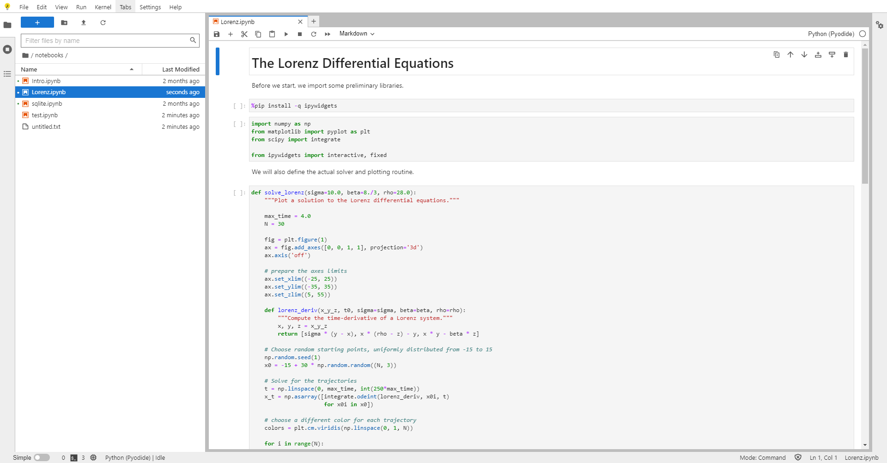

# 🪐 Jupyter

Jupyter est une série d'outils qui permet de tester toute sorte de code. Ils sont particulièrement efficaces dans l'exploration des données. Jupyter Lab est tout à fait adapté pour effectuer des calculs avec Spark, Python ou même R. Ce n'est pas tout à fait un éditeur au sens de VSCode ou RStudio, car il ne propose pas les mêmes fonctions pour le développement. Cependant, c'est un outil très performant.

Il est également possible [d'éditer vos notebooks depuis VSCode](vscode.md#les-extensions). Pour cela, il faut installer l'extension adaptée.

## Installation de Jupyter

* Utiliser le raccourci « pip-install-packages » situé dans le dossier Raccourcis situé sur votre bureau et conserver le terminal ouvert pour la durée de l'opération
* Utiliser le raccourci « Miniconda prompt » situé dans le dossier Raccourcis situé sur votre bureau.
* Saisir la commande `conda activate nomenvironnement` pour activer l'environnement de votre choix
* Saisir la commande `pip install jupyter` afin d'installer le paquet Jupyter
* Saisir la commande `python -m ipykernel install --user`

Votre installation de Jupyter est effectuée pour votre session. Il n'y a pas besoin d'effectuer cette installation de nouveau. Il faut juste être attentif à l'environnement conda que vous avez choisi pour effectuer cette installation.

## Lancement de jupyter lab

* Utiliser le raccourci « Miniconda prompt » situé dans le dossier Raccourcis situé sur votre bureau.
* Saisir `jupyter lab`
* Lorsque Windows vous demande de choisir un programme pour ouvrir la page web, choisir autre programme puis pointer sur « C:\Program Files\Chrome\chrome.exe »

<figure><figcaption>
Un exemple d'utilisation de Jupyter Notebook
</figcaption></figure>

## Utilisation de Jupyter Lab

Jupyter Lab est l'interface que vous pouvez observer ci-contre. Elle permet d'éditer et exécuter des fichiers. En particulier, les notebooks sont le format de fichier de prédilection dans un Jupyter Lab. Un Jupyter Notebook est composé de deux types d'éléments :

* les cellules de code (Python, PySpark ...)
* les cellules de texte (généralement, on utilise la syntaxe markdown)

L'intérêt de ce type de fichier, par rapport à un fichier python, est de pouvoir visualiser les résultats des cellules de code au fur et à mesure qu'on les exécute. On peut donc produire des graphs, mesurer précisément quel est le temps mis pour exécuter une instruction, etc.

Attention : afin de pouvoir bénéficier de la mise en forme de Jupyter, un fichier doit être un notebook, et donc s'achever par une extension .ipynb plutôt que par .py comme les fichiers python classiques.&#x20;
