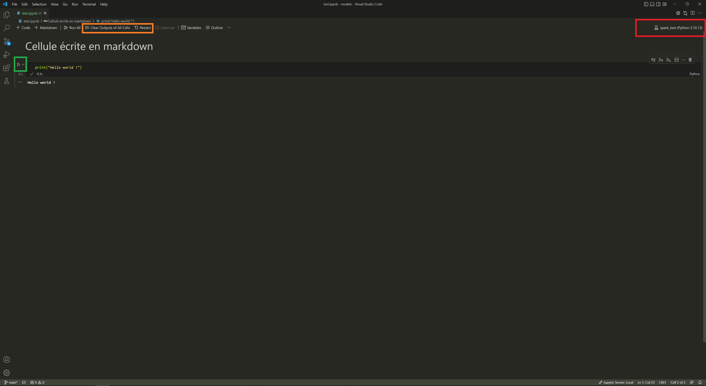

# 🐍 VSCode

VScode est l'environnement de développement le plus populaire au monde. Il permet pratiquement de coder avec tout langage de programmation. Cependant, l'utiliser nécessite une configuration plus importante du fait qu'il est très généraliste. Il offre de nombreuses fonctions pour pouvoir faciliter le développement de scripts et de programmes.

## Configurer Visual Studio Code

### Extensions

Vous pouvez installer des extensions à l'éditeur VSCode dans la bulle. Pour cela, voici la procédure :

* Dans VSCode, appuyez sur Ctrl+Shift+X pour ouvrir le menu extensions
* Dans les ... de ce menu, cliquez sur 'installer depuis VSIX'.
* Choissisez un fichier VSIX correspond à l'extension que vous souhaitez installer dans le dossier S:\VsCode

**Deux extensions sont obligatoires : ms-python.python et ms-tollsai.jupyter.**

Elles permettent de faire fonctionner Python et les notebook Jupyter avec Visual Studio Code.&#x20;

### Interpréteur pour Python

Une fois les extensions installées, pour utiliser votre environnement conda, appuyer sur "Ctrl+Shift+P" puis sélectionner "Python : select interpreter" et choisissez votre environnement.

Il est possible d'ouvrir des notebooks jupyter depuis VSCode ou d’exécuter les programmes dans une fenêtre interactive.&#x20;

### Ouvrir un notebook Jupyter

Si vous avez installé les deux extensions obligatoires. Vous pouvez ouvrir votre notebook avec le menu fichier > ouvrir un fichier (file > open file) et en selectionnant le notebook de votre choix (extension ipynb).

<figure><figcaption></figcaption></figure>

Grâce au choix du kernel, vous pouvez choisir quel python exécutera votre code (votre environnement conda correspondant). Vous pouvez choisir un kernel en utilisant le bouton situé dans le cadre rouge sur l'image ci-dessus.

Exécuter une cellule de code peut être effectué en appuyant sur la flèche située dans le rectangle vert.

J'ai également entouré d'un cadre orange deux boutons utiles : la remise à zéro du noyau (Restart). Elle permet de retirer toutes les informations stockées dans Python. Si vous l'utilisez, vous devez ré-executer les cellules les unes après les autres. \
Afin de ne pas se perdre, il est conseillé de nettoyer le résultat des cellules en même temps que la remise à zéro avec le bouton 'Clear Outputs of all Cells'.  Cela permet essentiellement de repartir à zéro en remettant le notebook à son point de départ.

### Lancer un programme depuis l'invite de commande

Si vous préférez lancer vos programmes dans un Terminal :

* Utiliser « Ctrl+Shift+P » puis chercher « Terminal : Select Default Profile »&#x20;
* Choisir « Command Prompt »&#x20;
* &#x20;Tuer les terminaux éventuellement ouverts avec l’icône corbeille

## Personnaliser VsCode

Faisons un tour d'horizons de certaines fonctions utiles :

1. **Langue :** VScode est utilisable en langue française en utilisant la touche F1, et en saisissant `Configure Display Language`
2. **Syntaxe :** La coloration syntaxique avancée et l'indentation automatique sont activées par défaut.
3. **Enregistrement et formatage automatique** : Vous pouvez demander à VSCode d'enregistrer le code pour vous en ouvrant les paramètres dans fichiers > préférences > paramètres. Recherchez le paramètre Auto-save. De plus, VSCode peut formatter le fichier à chaque enregistrement de celui-ci à l'aide du paramètre Format On Save.
4. **Git intégré** : VSCode est livré avec une intégration Git native, cette interface peut être plus simple d'utilisation que le terminal. Pour l'utiliser, le bouton se situe dans la colonne de gauche et se nomme Contrôle de code source.
5. **Débuggeur intégré**: À l'aide des points d'arrêt dans le code, vous pouvez suivre l'exécution à l'aide du mode debug. Vous pourrez visualiser l'évolution des variables. Le mode débug de VSCode se situe juste en dessous de l'intégration git dans la colonne de gauche.
6. **Terminal intégré :** VSCode propose un terminal intégré qui vous permet d'exécuter des commandes Python et d'autres tâches sans quitter l'éditeur. Pour cela, utilisez le menu terminal.
7. **Autocomplétion et formatage :** Dans la bulle, vous pouvez bénéficier de l'extension Pylance qui permet de compléter de façon automatisée le code, ainsi que d'assurer un formatage optimal. Pour cela, il suffit d'installer cette extension comme vous l'avez fait [pour python et Jupyter précédemment](vscode.md#configurer-visual-studio-code).

<figure><figcaption>
VScode est un éditeur de code généraliste
</figcaption></figure>

