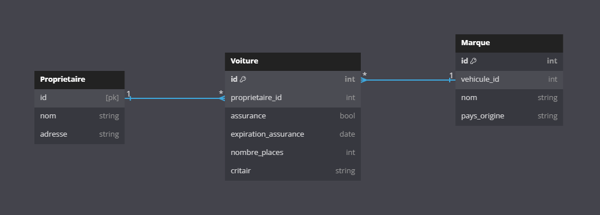

# 👩🏫 Les bases SQL

## Un rappel sur les bases SQL

Une base de données SQL est un système qui permet de stocker des données organisées en tables, connectées les unes aux autres par des clés. L'intérêt principal est d'éviter de dupliquer des informations qui se retrouveraient de façon multiples dans une seule table. Cela permet aussi de représenter de manière fidèle ce qui se passe dans un processus métier. \
\
Par exemple :&#x20;

<figure><figcaption><p>Voici un schéma de base de données simple</p></figcaption></figure>

Sur ce schéma, on voit que j'ai d'abord représenté un premier acteur métier : le propriétaire du véhicule. J'ai mis dans sa table les informations le concernant. En particulier, chaque utilisateur (véhicule, voiture et moto d'ailleurs) possède un identifiant unique qui permet de l'identifier. C'est ce qu'on l'on appelle la clé Primaire de la table. Cela nous permettra plus tard de faire les liens entre les tables.

Ensuite, un propriétaire peut posséder 0, 1 ou plusieurs voitures. C'est ce qu'on l'on voit à la présence du symbole \* à droite de la liaison entre les propriétaires et les véhicules. Par contre,  on sait qu'un véhicule n'est associé qu'à un seul propriétaire à la présence du 1 à gauche de la liaison entre ces deux tables.

Enfin, un véhicule possède une marque. Mais une marque peut être associée à plusieurs voitures.&#x20;

### Pour aller plus loin sur la construction d'une base de données SQL :&#x20;

* Les formes normales qui doivent être respectées lorsque vous créez votre base
* Le site [dbdiagram.io](https://dbdiagram.io/) qui vous permet de réaliser vos propres schémas, et les exporter vers [MySQL](les-bases-de-donnees-disponibles-au-casd.md#mysql)

## La syntaxe SQL pour effectuer des requêtes

Une requête SQL pour obtenir des données sur une table commence par les instructions SELECT et FROM :

```sql
SELECT id, nom
FROM Proprietaire
```

Le SELECT permet de choisir quelles sont les colonnes qui m'intéressent dans la table (ici, je ne veux pas les adresses). L'instruction FROM permet de préciser dans quelle table ces informations doivent être cherchées.&#x20;

Admettons maintenant que je veux les voitures dont la vignette critair est A. Je peux utiliser un filtre afin d'obtenir cette information facilement :&#x20;

```sql
SELECT *
FROM Voiture
WHERE critair = "A"
```

Notez ici que j'ai utilisé SELECT \*, qui signifie, sélectionner l'ensemble des colonnes de la table. L'instruction WHERE permet-elle de définir le filtre. Ici, j'ai filtré les lignes selon la colonne Crit’Air et si la valeur valait A ou non.

Enfin, admettons que je veux les informations sur les voitures, dont la marque est Renault. Ces informations sont contenues dans deux tables différentes pour ne pas dupliquer les informations concernant Renault à chaque véhicule de la marque enregistré dans la table Voiture. Je vais donc devoir faire une jointure. Une jointure, c'est le fait de réunir deux tables en utilisant des identifiants pour apparier leurs données.&#x20;

Par exemple :&#x20;

```sql
SELECT *
FROM Voiture
JOIN Marque
ON Voiture.id = Marque.vehicule_id
WHERE marque.nom = "Mercedes"
```

J'effectue d'abord la jointure avec la table Marque avec le mot clé JOIN. Je dois indiquer quels sont les arguments qu'il faut utiliser pour faire le lien. J'utilise donc le ON qui indique sur quoi on va joindre les tables. Les arguments égaux dans les deux tables sont l'identifiant de la voiture (id dans la table Voiture) et le vehicule\_id dans la table Marque. \
Enfin, j'applique le filtre sur le nom de la marque dans la table correspondante.

Avec ces instructions, vous pouvez effectuer la plupart des requêtes classiques.&#x20;

### Pour aller plus loin sur les requêtes de données avec SQL :&#x20;

* Les fonctions d'agrégats avec les groupements permettent de faire des calculs évolués
* Le site [sql.sh](https://sql.sh/) qui propose des cours plus détaillés sur la syntaxe SQL

## Créer des tables et insérer des données

Si vous souhaitez mettre en place votre propre base, vous pouvez d'abord [choisir une base de données](les-bases-de-donnees-disponibles-au-casd.md), la créer et utiliser les instructions qui vont suivre pour créer vos tables.

Créer la table Voiture dans une base de données peut être fait de la manière suivante :

<pre class="language-sql"><code class="lang-sql">CREATE TABLE Voiture (
id INT(11) unsigned NOT NULL AUTO_INCREMENT,
proprietaire_id INT(11),
assurance BOOLEAN DEFAULT 0,
<strong>expiration_assurance DATETIME,
</strong>nombre_places INT(2),
critair VARCHAR(1),
PRIMARY KEY (id),
FOREIGN KEY (proprietaire_id) REFERENCES Proprietaire(id);
</code></pre>

Insérer des données dans cette table peut être fait plus simplement une fois que la table est créée :&#x20;

```sql
INSERT INTO Voiture (proprietaire_id, assurance, nombre_place) 
VALUES (1, 1, 5);
```

Ici, je ne connais pas la date d'expiration d'assurance ni la valeur de la vignette crit'air, je ne les ai donc pas remplis. Comme ces arguments ne sont pas en NOT NULL dans la table Voiture, cela ne pose pas de problèmes. De plus, l'identifiant dans la table est auto-incrémenté, je ne le saisis donc pas à la création d'une nouvelle ligne. J'ai ici simplement indiqué l'identifiant du propriétaire, le fait que la voiture était assurée, et qu'elle possédait 5 places.

### Pour aller plus loin sur la création d'une base de données SQL :&#x20;

* Le [cours de la W3Schools](https://www.w3schools.com/sql/sql\_datatypes.asp) sur les types supportés en SQL
