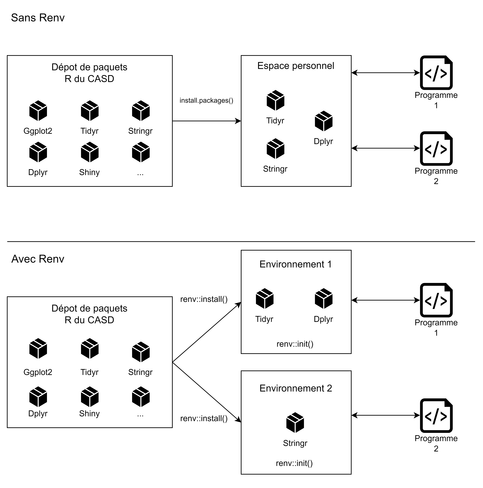

# 📊 Les environnements renv

## Principe de fonctionnement

Renv est un système permettant de faciliter la gestion des paquets R que vous allez utiliser dans vos différents programmes. Il permet d'avoir un dossier dans lequel l'ensemble des paquets mobilisés par un programme sont répertoriés.&#x20;

Ce dossier est distinct des dossiers contenant les paquets pour les autres programmes.&#x20;

<figure><figcaption><p>Avec Renv, les paquets sont rangés par programme de calcul !</p></figcaption></figure>

Cette façon de gérer les dépendances d'un programme présente plusieurs avantages :&#x20;

* Elle permet d'utiliser des versions différentes d'une même librairie pour deux programmes différents
* Elle limite le risque de conflits si un paquet repose lui-même sur un autre paquet dans une version différente de celle que vous souhaitez installer (le risque d'apparition de ce type de problème est plus important si tous les paquets sont installés au même endroit)
* Elle permet de transférer facilement la configuration et les dépendances d'un programme à un autre utilisateur, qui pourra reproduire l'environnement d'exécution facilement

## En pratique

### Initialiser l'environnement

```r
renv::init()
```

Cette commande crée un dossier library dans lequel vos paquets seront stockés.&#x20;

Elle crée également un fichier lockfile renv.lock, qui contient les métadonnées des librairies installées. C'est ce qui permet de créer l'environnement de nouveau dans un autre espace.&#x20;

Enfin, elle crée un fichier .Rprofile qui contient les informations pour assurer que Renv démarre lorsque le projet R contenant votre programme R est chargé dans la session R.

### Installer un paquet

```r
install.packages("tidyr")
```

De façon alternative :

```r
renv::install("tidyr")
```

### Partager son environnement

Une personne souhaitant reconstruire l'environnement d'une autre personne doit simplement exécuter :&#x20;

```r
renv::restore()
```

dans un projet contenant un fichier renv.lock, .Rprofile, renv/settings.json et renv/activate.R, qui sont créés automatiquement lorsque renv::init() est appelé par la personne transmettant le code. Ainsi, il suffit de transmettre le code, ainsi que les fichiers cités, sans les librairies. La personne recevant le programme peut alors utiliser restore afin de recréer l'environnement à l'identique.&#x20;

### Désactiver Renv

Il est possible de désactiver Renv pour un projet. Avec l'option clean = False, les fichiers sont conservés, avec clean=True, renv supprime l'ensemble des fichiers associés à renv sur ce projet (sauf votre code bien sûr).&#x20;

```r
renv::deactivate(clean = FALSE)
```

et de le réactiver plus tard si nécessaire :&#x20;

```r
renv::activate()
```
