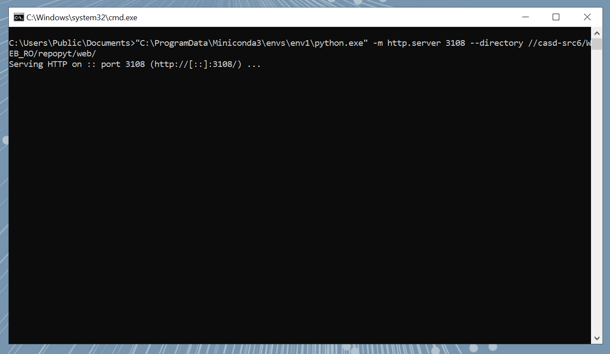
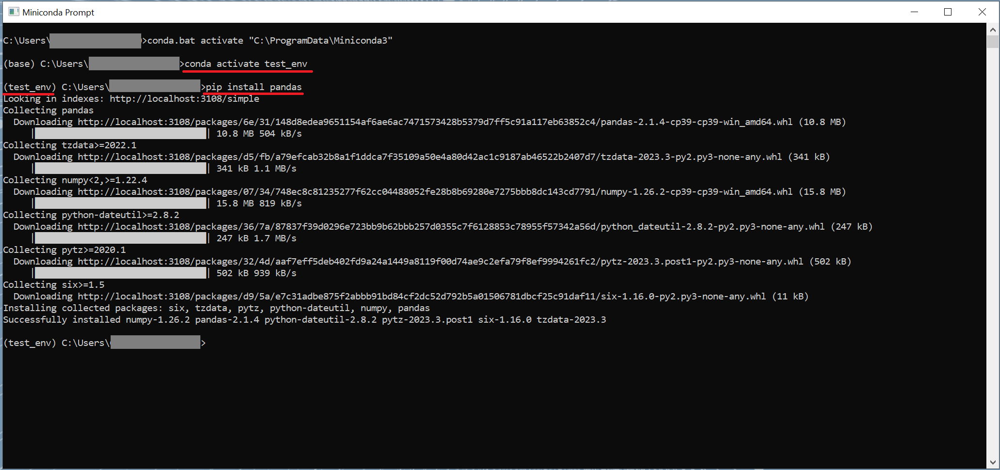

# 🐍 Installer les paquets python

## Installer un paquet python

En python, le gestionnaire de paquets à utiliser au CASD est pip car c’est un serveur PYPI qui est synchronisé. Le CASD vous met à disposition un script qui permet d'assurer le lancement du serveur contenant les paquets :

* **Lancez le script pip-install-package depuis  le dossier "Python" situé dans le dossier "Raccourcis" situé sur votre bureau**. Ne fermez pas la fenêtre obtenue tant que vos packages ne sont pas installés.

<figure><figcaption><p>Le script d'installation de paquets disponible dans le dossier Python devrait ressembler à ceci. Il faut le laisser ouvert pendant la manipulation !</p></figcaption></figure>

L’environnement conda de votre choix doit être créé et activé (voir chapitre 1). Il vous faudra ouvrir un Miniconda prompt depuis l'espace raccourci et utiliser la commande :

* Dans l'anaconda prompt ouvert, saisissez :

```bash
conda activate nom_de_votre_environnement
```

puis :

```bash
pip install nom_du_package_souhaité
```

<figure><figcaption><p>Ici, on observe que pip contacte le serveur local afin de procéder à l'installation de Pandas et de ses dépendances !</p></figcaption></figure>

Dans votre code python, utilisez cette instruction pour importer votre paquet, comme vous le feriez en dehors de l'espace de travail sécurisé :

```python
import package_name
```

Il est très fortement recommandé d’utiliser un fichier requirements.txt, et y consigner les paquets que vous utilisez les uns sous les autres. La commande d’installation qui permet d’obtenir l’ensemble des paquets depuis le dépôt est alors :

```bash
pip install –r requirements.txt
```

**Attention :** Notez l'utilisation de l'argument -r qui précise que l'on doit installer les paquets depuis un fichier. Oublier le -r impliquera que pip essaiera d'installer un paquet nommé littéralement requirements.txt, et échouera donc.

Avec ce fichier, vous pourrez ainsi exécuter votre code sur une autre machine en créant un environnement python vierge, l’activant, et en exécutant la commande ci-dessus dans le terminal. Votre environnement sera reproductible, pas vous, ainsi que d'autres collaborateurs de votre projet (voir [Travail collaboratif](../collaborer/)).
