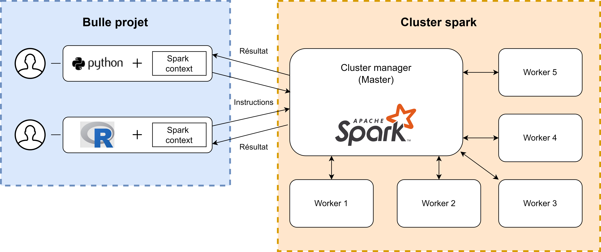

---
layout:
  title:
    visible: true
  description:
    visible: true
  tableOfContents:
    visible: true
  outline:
    visible: true
  pagination:
    visible: false
---

# 🚧 Installer et paramétrer Spark

## Principes généraux

> _Qu'est ce qu'un cluster ? Quelle différence avec Spark ?_
>
> Un cluster est un regroupement de machines de travail (les workers), sous la direction d'une machine maître (le master). Le master se charge de distribuer le travail sur les différents machines de travail et de collecter les résultats. Cela permet de travailler de façon parallèle, et donc de gagner du temps. Spark est un logiciel avec lequel vous allez échanger pour faire fonctionner un cluster. Vous pouvez écrire vos instructions dans une syntaxe plus proche du R : c'est SparkR, ou bien avec une syntaxe proche du Python : c'est PySpark ! Il est à noter que l'on peut tout à fait utiliser Spark sans cluster, c'est le mode local. De même, on peut interagir avec un cluster avec d'autres logicielles que Spark.

Voici un aperçu simplifié du fonctionnement d'un cluster Spark :

<figure><figcaption><p>Un exemple de cluster Spark</p></figcaption></figure>

Un cluster Spark est un outil puissant qui permet d'accélérer grandement la vitesse d'exécution de vos calculs. De plus, la puissance du cluster et sa taille sont plus modulables qu'une machine seule à laquelle on ajoute des ressources : il suffit d'ajouter des workers. Cependant, l'utilisation de cet outil n'est pas toujours aussi aisée que lorsque l'on s'adresse une machine seule avec R. Voyons d'abord comment installer les paquets nécessaires pour pouvoir s'adresser à Spark en R, puis en python. Ensuite, nous verrons comment réserver des ressources (il s'agit de la notion de Spark Context sur le schéma, aussi appelée SparkSession aujourd'hui). Cela nous permettra de simuler un cluster en exécutant nos codes localement avec Spark. Les personnes possédant un accès à un cluster apprendrons ensuite à modifier l'instruction SparkSession, afin de passer du mode local au mode cluster. Enfin, nous verrons comment utiliser notre cluster pour effectuer des calculs simples.

## Effectuer les installations nécessaires

### Installer Spark

Pour simplifier l'installation de Spark, nous avons conçu un script qui effectue cette installation de façon automatisée. Il est situé dans l'espace commun. Que vous souhaitiez adresser le logiciel Spark avec une syntaxe proche de R ou de Python, cette étape est nécessaire.

Cliquez sur AutoInstallSpark.bat afin d'effectuer l'installation.

**Attention :** Vous devez attendre la fin du script et qu'il demande d'appuyer sur entrée pour terminer. Il ne faut pas fermer la fenêtre du terminal ouvert pendant le script, cette opération n'est pas très longue.

Ce script décompresse l'archive contenant Spark, copie les fichiers nécessaires à son utilisation sous Windows, et paramètres les variables d'environnement.

Vous pouvez tester l'installation avec la commande suivante dans un terminal de commande (cmd) :

```bash
spark-shell
```

### Installer le package SparklyR pour travailler avec SparkR dans Rstudio

Si vous souhaitez utiliser SparkR pour soumettre vos instructions au cluster, vous aurez besoin de la librairie SparklyR. Voici la marche à suivre une fois que l'installation de Spark a été effectuée :

Procédez d'abord à l'installation du package SparklyR à l'aide du dépôt, comme dans les chapitres précédents, puis chargez-le :

```r
install.packages("sparklyr")
library("sparklyr")
```

Ensuite, connectez-vous au cluster :

```r
sc <- spark_connect(master="local")
```

Vous possédez un serveur Spark adressable avec R pour votre application !

### Installer PySpark et adresser le cluster avec un Notebook Jupyter

PySpark est inclus nativement avec Spark. Une fois l'installation de Spark effectuée avec le script fourni, vous pouvez accéder à pyspark dans votre application avec la commande :

```bash
pyspark
```

### Installer les autres dépendances de Spark

Les fichiers Jar additionnels dont vous pouvez avoir besoin pour installer des librairies Spark peuvent être obtenus dans le même dossier que pour l'installation de SparklyR : dans S:\Spark\jar\_files. Vous trouverez ici les binaires à copier, par exemple, celui qui permet d'ouvrir un fichier SAS avec Spark : spark-sas7bdat, dans différentes versions. De même, vous pourrez installer parso avec la manœuvre qui suit :

* Copiez le Jar de votre choix dans le dossier : "C:\Users\projet\_0\_p\_nom0000\AppData\Local\spark\spark-3.3.2-bin-hadoop2\jars"

## Réserver des ressources avec l'instruction SparkSession pour le mode local

> _Mode local ? Mode cluster ?_
>
> Le mode local est le fait d'utiliser Spark sur sa machine actuelle. Il n'y a donc qu'une machine qui travaille, ici, c'est votre bulle. Spark utilise les capacités de cette machine pour lui faire effectuer des tâches de façon parallèle. Il reste donc intéressant d'utiliser ce mode, car des gains algorithmiques sont effectués. Il n'y a cependant pas vraiment de workers comme dans le schéma initial présenté, ils sont fictifs, puisqu'il n'y a qu'une machine. Le mode cluster est le fait d'utiliser un parc de machine distant sur lequel Spark est installé. On se connecte alors au noeud principal (c'est le master), et on donne des instruction à ce master qui fait travailler des workers. C'est le schéma initialement présenté. Si votre projet dispose d'un cluster, il vous est possible de l'utiliser, afin d'accélérer vos calculs, avec plus de ressources qu'en mode local.

Spark utilise massivement la mémoire afin d'accélérer de façon drastique vos calculs. Pour cette raison, il est très important de bien déterminer les ressources que vous souhaitez allouer à votre session. Une fois allouée, et tant que cette session ne sera pas achevée, elles seront réservées.

> _Comment les ressources sont elles partagées entre les utilisateurs du cluster ?_
>
> Attention: dans un cluster spark les ressources sont partagées et vous devez en réserver une partie de façon préalable pour effectuer un traitement. C'est ce que nous allons apprendre à faire dans cette section, en python et en R. Il est fondamental de libérer les ressources après utilisation en fermant votre session spark avec l'instruction spark.close() ! Autrement, vos ressources restent allouées, même après la fin de votre traitement. De même, il convient d'être raisonnable en choisissant une allocation mémoire et processeur adaptée à votre traitement afin de laisser des ressources aux autres utilisateurs du cluster.

### En PySpark :

```python
from pyspark.sql import SparkSession

# Configuration des ressources
spark = SparkSession.builder \
    .appName("ExempleJointureSimple") \  # Nom de l'application Spark
    .config("spark.executor.memory", "8g") \  # Mémoire allouée par exécuteur
    .config("spark.executor.cores", 4) \  # Coeurs par exécuteur
    .config("spark.driver.memory", "4g") \  # Mémoire allouée au driver (processus principal)
    .config("spark.driver.cores", 2) \  # Coeurs alloués au driver
    .getOrCreate()
```

Voiçi un exemple simple de configuration Spark. Les ressources doivent être proportionnelles à la tâche effectuée et aux données traitées par votre application.

### Avec SparklyR :

```r
library(sparklyr)

# Configuration des ressources
config <- spark_config()

config$spark.executor.memory <- "8g" # Mémoire allouée par exécuteur
config$spark.executor.cores <- 4 # Coeurs par exécuteur
config$spark.driver.memory <- "4g" # Mémoire allouée au driver
config$spark.driver.cores <- 2 # Coeurs alloués au driver

# Création de la connexion Sparklyr
sc <- spark_connect(master = "local", config = config, version = "3.3.2")
```

## Passer en mode cluster

Si vous accès à un cluster dans votre projet, vous pouvez quitter le mode local et passer en mode cluster afin de disposer d'une plus grande quantité de ressources.

Pour cela, rien de plus simple, il suffit de réutiliser les configurations du mode local, en mettant à jour les valeurs paramètres vers des valeurs plus adaptées à la puissance de calcul de votre cluster.

Il suffit ensuite de modifier l'instuction de connexion :

En SparklyR :

```r
# URL du cluster Spark
cluster_url <- "spark://adresse_du_cluster:port"

# Création de la connexion Sparklyr en mode cluster
sc <- spark_connect(master = cluster_url, config = config, version = "2.4.7")
```

En PySpark :

```
from pyspark.sql import SparkSession

# Configuration des ressources pour le cluster
spark = SparkSession.builder \
    .appName("MonApplication") \  # Nom de l'application Spark
    .config("spark.executor.memory", "8g") \  # Mémoire allouée par exécuteur
    .config("spark.executor.cores", 4) \  # Coeurs par exécuteur
    .config("spark.driver.memory", "4g") \  # Mémoire allouée au driver
    .config("spark.driver.cores", 2) \  # Coeurs alloués au driver
    .config("spark.master", "spark://adresse_du_cluster:port") \  # URL du gestionnaire de cluster Spark
    .getOrCreate()
```
