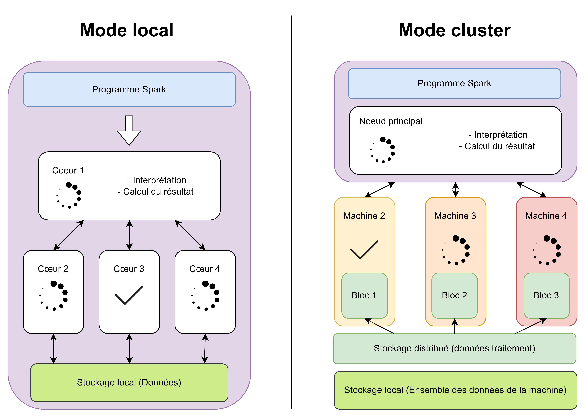

# 👩🏫 Comprendre les traitements avec Spark

## Qu'est-ce que Spark ?

Spark est un moteur de calcul multi-langage, orienté pour traiter des grands volumes de données, sur une machine locale, ou sur plusieurs machines formant un cluster.

Il permet d'effectuer toutes sortes de tâches :&#x20;

* De la gestion de données avec SQL
* Du traitement de données en streaming - au fur et à mesure que celles-ci arrivent -
* Du machine learning avec la librairie MLlib
* Des graphs avec GraphX

Il peut être utilisé avec une syntaxe proche de Python : c'est PySpark, et avec une syntaxe proche de R,  c'est SparkR ou sparklyR (pour les amateurs de deeplyr en particulier).

## Pourquoi utiliser Spark ?

Spark offre un niveau de performance très élevé : il est capable d'effectuer de multiples tâches en même temps, tout en faisant une utilisation optimale de la mémoire. C'est un moteur nativement pensé pour la haute performance.&#x20;

De plus, s'il devient nécessaire de faire fonctionner le code sur un cluster, pour traiter de très grands volumes, le code Spark écrit pour une machine local est identique. Il suffit de modifier la configuration afin de faire fonctionner le programme sur un cluster plutôt que sur sa machine locale.

Enfin, Spark est disponible avec de multiples syntaxes, pour favoriser son accessibilité.&#x20;

## Mode local contre mode distribué

Spark est un logiciel capable d'effectuer des tâches de façon parallèles. C'est-à-dire : effectuer plusieurs morceaux de calculs en même temps, puis rassembler les résultats obtenus en un seul morceau. \
Par exemple : si on souhaite appliquer un traitement à chaque ligne d'une table contenant un grand nombre d'observations : il est intéressant d'utiliser cette technique, car on va diviser le temps total de l'opération par le nombre de tâches que l'on peut effectuer de manière parallèle.&#x20;

Le mode local est le fait d'utiliser Spark sur sa propre machine. Il n'y a donc qu'une machine (virtuelle ici) qui travaille, c'est votre bulle. Spark utilise les capacités de cette machine pour lui faire effectuer des tâches de manière parallèle. Ce mode permet d'effectuer des gains algorithmiques. En effet, si la machine possède plusieurs cœurs, on peut effectuer plusieurs tâches à la fois plutôt que de les faire les unes à la suite des autres. Sur le schéma ci-dessous, c'est la représentation de gauche :&#x20;

<figure><figcaption></figcaption></figure>

La machine locale est représentée en violet. On voit que le programme est d'abord lu et interprété par Spark. Celui-ci prépare un plan d'action, où chaque cœur demandé sera mis à contribution. Les calculs sont alors effectués, et les données mobilisées viennent du disque local. Elles sont donc accessibles à chaque cœur. Une fois les calculs intermédiaires effectués sur chaque cœur, le résultat est regroupé et affiché/stocké selon la demande du programme.&#x20;

Le mode cluster est le fait d'utiliser un parc de machines distantes sur lequel Spark est installé. On se connecte alors au nœud principal (c'est le master), et on donne des instructions à ce master qui fait travailler des workers. En pratique, cela veut dire faire exécuter les différents morceaux du traitement sur plusieurs machines distinctes, plutôt que sur la même. Cela possède l'intérêt de cumuler les puissances de calculs de plusieurs machines. Cependant, cela génère aussi un trafic réseau important, car il faut faire communiquer les machines. Cette organisation des machines est nommée cluster. La maintenir et la déployer est en général à la charge de votre fournisseur d'accès. Cependant, [comprendre le fonctionnement d'un cluster](../clusters/) permet de l'utiliser de façon optimisée. Le CASD propose un service de mise à disposition d'un cluster de calcul privatif pour les projets le nécessitant. Ce cluster n'est pas partagé avec d'autres bulles afin d'assurer une totale isolation, comme sur une bulle classique.

Sur le schéma au-dessus, à droite, c'est le nœud principal qui est chargé de préparer un plan de distribution pour les différentes machines composant le cluster. Ce plan prend notamment en compte quelle machine possède déjà quelles données. C'est ce que l'on appelle le stockage distribué.

## Les ressources avec Spark

Spark utilise massivement [la mémoire ](../performance-calculs/ressources.md#la-memoire)pour accélérer de manière drastique vos calculs. Il s'agit du gain principal de cette technologie par rapport aux plus anciennes comme Hadoop. En effet, en chargeant les données dans la mémoire, cela permet de les lire plusieurs fois de manière quasi instantanée. Cependant, il faut être attentif à la consommation mémoire et ne pas charger à plusieurs reprises les mêmes données. Il s'agit du même problème qu'en R. Cela peut créer des saturations mémoires et consommer énormément de places pour des résultats peu probants. Quel que soit le mode utilisé, il est possible de configurer la mémoire utilisée par Spark, et donc celle allouée à chaque partie du sous-traitement sur un cœur en mode local ou une machine en mode Cluster.

Pour cette raison, il est très important de bien déterminer les ressources que vous souhaitez allouer à votre session. Une fois allouée, et tant que cette session ne sera pas achevée, elles seront réservées. Indépendamment du mode choisi, une bonne gestion ressources est essentielle pour le travail collaboratif.&#x20;
