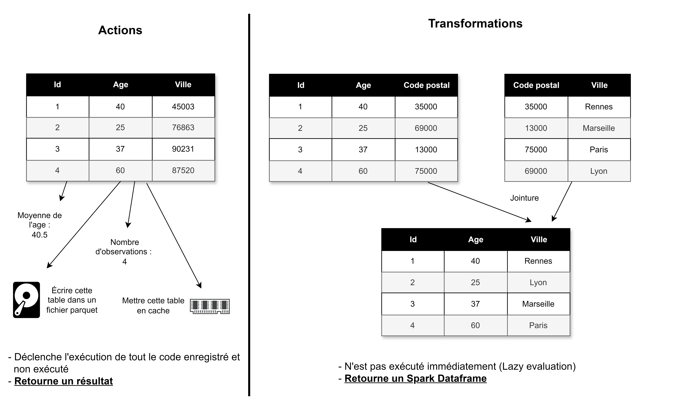

# 💤 Actions ou transformations ?

## Différence entre les deux notions

Spark différencie les transformations et les actions. Une transformation prend un tableau en entrée, et retourne un autre tableau. Une action prend un tableau en entrée et retourne autre chose qu'un tableau. Voici un schéma qui montre la différence entre ces deux notions :&#x20;

<figure><figcaption>
Lorsque l'on apelle un count, un show, ou que l'on calcule une moyenne, le calcul est déclenché 
</figcaption></figure>

\
Cette différence est très importante à cause du phénomène de **lazy evaluation**. Comme nous l'avons vu, Catalyst optimise le code en réorganisant les étapes. Cela ne peut être fait que lorsque l'on exécute plusieurs lignes à la fois. Par conséquent, Spark attend qu'une action (show, write, collect, count, ...), soit déclenchée afin d'effectuer les traitements. C'est pour cela que faire un groupBy est instantané dans une cellule de Jupyter Notebook, mais qu'afficher le résultat avec un show dans une autre cellule ne l'est pas : Spark exécute physiquement l'instruction groupBy au moment de l'activation de la cellule d'affichage. Il faut donc être conscient de la nature de l'instruction lorsque l'on crée un programme spark - pour assurer que l'on sait à partir de quelle ligne le code débute son éxecution, et quelles sont les sections optimisées.

## Transformations Narrow contre Wide

Spark introduit la notion de dépendance entre deux tableaux pour les transformations qu'il propose. Il en existe deux types : Narrow et Wide. On dit d'une transformation qu'elle possède une dépendance Narrow si chaque partition du résultat dépend d'une partition de l'entrée. À l'inverse, une transformation possède des dépendances Wide si les partitions du résultat possèdent des données de différentes partitions d'origine. Observez plutôt le schéma suivant pour comprendre cette notion :&#x20;

<figure><figcaption></figcaption></figure>

Les transformations Spark dites de type Narrow sont en autres :

* Union
* Map
* Filter
* Certaines jointures lorsque les données sont partitionnées selon leurs clés.

Par exemple, lors d'un filtre, on peut appliquer le filtre aux données de chaque nœud. Il est inutile de mobiliser des données de plusieurs nœuds pour cette opération. Cela correspond au fonctionnement à gauche du schéma. On execute sur chaque noeud contenant les données le filtre en question, il suffit d'appliquer la transformation là ou les données sont déjà présentes. Il n'y a pas de mouvement !

Ce n'est pas le cas pour :&#x20;

* GroupBy
* Repartition
* Intersection
* Distinct
* Join

Ces transformations sont naturellement de type wide (sauf cas très particulier, comme un tableau bien partitionné). Par conséquent, lorsque vous les appliquez, elles forcent presque systématiquement des mouvements de données. Par exemple, dans le cas d'un GroupBy, il est bien nécessaire d'utiliser les données des différents nœuds afin d'effectuer les groupements demandés. Il y a donc shuffling.

Les opérations de type Narrow peuvent être facilement enchainées, réparties sur différents nœuds, et sont donc moins couteuses. Ce n'est pas le cas des opérations wide.
