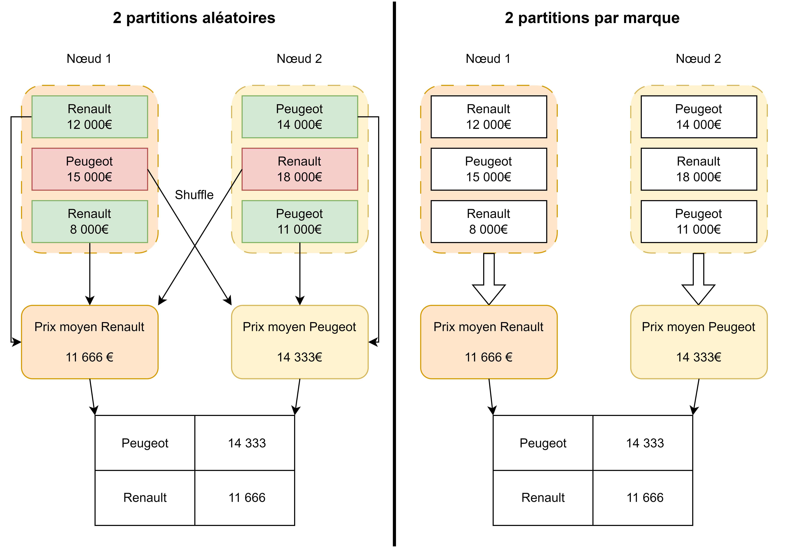

# 🧩 Partitionner une table selon une variable

## Partitionnement ?

Le partitionnement pour un dataframe Spark, c'est une façon de le ranger, de l'organiser, de le stocker. Cela ne change pas le contenu de la table ou les lignes, mais comment on va diviser cette table en sous-ensembles.&#x20;

On appelle chacun de ces sous-ensembles partition. Il peut y en avoir plus ou moins selon le critère pour construire les sous-ensembles. On peut partitionner de façon purement mathématique, en demandant un nombre fixe de partitions que l'on traitera de façon indépendante, comme des batchs. Mais on peut aussi partitionner de façon 'métier', afin de regrouper les données d'une manière qui a du sens par rapport au traitement. Par exemple, diviser une table contenant des véhicules par marque. S'il y a 10 marques de voitures dans la table, on obtiendra 10 partitions à traiter.

## Pourquoi partitionner ?

Partitionner, cela permet de tirer pleine puissance des architectures distribuées. Une bonne partition, cela permet de minimiser les mouvements de données lors des traitements. C'est donc un gain de performance très important.&#x20;

### Une règle générale de partitionnement

> La règle générale pour trouver les variables par lesquelles on doit partitionner est de regarder quelles variables sont utilisées pour faire des group by et des filtres à plusieurs reprises.

Par exemple, dans l'exemple précédent sur les véhicules, si l'on va ensuite calculer la moyenne de prix des véhicules pour chaque marque, le temps de calcul va être drastiquement réduit : il suffit d'appliquer la fonction moyenne à chaque sous-ensemble. Cela signifie concrètement qu'au moment d'effectuer un group by (instruction de nature wide, donc couteuse, et qui engendre des mouvements de données), aucun mouvement ne se produira. En effet, la moyenne sera simplement appliquée à l'endroit où chaque partition est stockée (sur chaque worker).&#x20;

Observez ce schéma qui résume cet exemple :&#x20;

<figure><figcaption></figcaption></figure>

L'utilisation d'une partition par la variable marque permet d'éviter l'envoi des données entre les deux nœuds puisque toutes les données du calcul sont déjà accessibles par celui-ci ! Il n'y a donc pas de shuffle, qui est très couteux en temps et en ressources. Admettons que je souhaite ensuite calculer l'écart type, puis le maximum et minimum de chaque marque, on effectue des gains de temps pour chacune de ces opérations. Cela peut donc se révéler très rentable. De plus, même dans le cas d'un calcul de moyenne général, ce choix de partition n'est pas pénalisant ! Ici, on peut donc parler de partitionnement 'naturel'.

Une partition peut être vue comme pré-traiter les données avec un group-by. Cela peut être payant si on va de toute façon appliquer un tel group by à plusieurs reprises.&#x20;

### Les cas défavorables

Cependant, il faut aussi être prudent lorsque l'on partitionne. Si on choisit une partition inadaptée au traitement, cela peut engendrer encore plus de mouvements de données ! En effet, une table partitionnée avec beaucoup de partitions est plus longue à interroger lorsque l'on mobilise des données dans beaucoup de partitions. &#x20;

Voici le résultat d'un benchmark que nous avons effectué sur une table :

<table><thead><tr><th width="409">Requête / Partitions </th><th width="113" align="center">2</th><th width="103" align="center">5</th><th align="center">1000</th></tr></thead><tbody><tr><td>Requête sur une colonne qui a servi au partitionnement</td><td align="center">74,50%</td><td align="center">46,30%</td><td align="center">16,66%</td></tr><tr><td>Requête vers une autre colonne</td><td align="center">89,51%</td><td align="center">191,01%</td><td align="center">556,99%</td></tr><tr><td>Select distinct(*)</td><td align="center">136,79%</td><td align="center">163,68%</td><td align="center">1194,88%</td></tr></tbody></table>

On voit que le gain de temps est réel sur les requêtes avec des colonnes qui ont servi au partitionnement. Cependant, cela fait augmenter le temps de calcul sur les requêtes qui mobilisent plusieurs partitions. La meilleure solution est donc souvent de choisir une partition avec un nombre limité de valeurs afin d'éviter l'écueil principal : faire trop de partitions.

Il n'existe pas de partitionnement idéal ou par défaut, il faut toujours réfléchir à l'utilisation des données pour déterminer le partitionnement à utiliser.

## Comment partitionner ?



Par nombre de partitions :

```python
my_dataframe.repartition(10)
```

ou par variable(s) :&#x20;

```python
my_dataframe.repartition("my_variable")
```

On peut aussi partitionner avec plusieurs variables, en remplaçant la chaine de caractère par un vecteur.



Par nombre de partitions :

```r
repartitioned_df <- repartition(my_dataframe, 10)
```

ou par variable(s) :&#x20;

```r
repartitioned_df <- repartition(my_dataframe, my_dataframe$my_variable)
```

On peut aussi partitionner avec plusieurs variables, en remplaçant la variable par un vecteur.



Par nombre de partitions :

```r
sdf_repartition(my_dataframe, partitions = 10, partition_by = NULL) 
```

ou par variable(s) :&#x20;

```r
sdf_repartition(my_dataframe, partitions = NULL, partition_by = "my_variable") 
```

On peut aussi partitionner avec plusieurs variables, en remplaçant la chaine de caractère par un vecteur.



## Exemples de partitionnements par variables pertinents :

Si on accède à des données géographiques, il est intéressant de partitionner par région/département/ville. On va gagner beaucoup de temps lors de la lecture par la suite.

Imaginons que l'on étudie une table sur des individus, contenant des données de santé ou des données économiques, selon le contexte d'utilisation et selon la manière même dont la table est construite, le partitionnement peut totalement changer.

Si dans cette table, plusieurs lignes correspondent à des informations sur le même individu, et donc qu'il n'est pas unique, on peut partitionner avec l'identifiant de l'individu. C'est particulièrement efficace si on va effectuer des traitements par individus par la suite.&#x20;

Si dans cette table, chaque individu est unique, et que l'on va chercher à faire des groupes, le partitionnement par individu est inutile. En effet, on ne fera pas de regroupement puisqu'un individu correspond à une ligne dans la table. Par contre, on peut partitionner par la variable Sexe et Age par exemple.

La documentation officielle sur le [repartitionnement d'une table](https://spark.apache.org/docs/3.1.3/api/python/reference/api/pyspark.sql.DataFrame.repartition.html)

## La règle générale si on ne peut pas partitionner par variable

En règle générale, le nombre de partitions d'une table doit être contenu entre :&#x20;

Au minimum : 2 x le nombre de cœurs choisis pour l’application

Au maximum : au moins 100ms de temps d'exécution par partition, au dela, c'est que la table est trop partitionnée, et donc on perd du temps lors des opérations qui nécéssitent un shuffling.

Cependant, cette règle générale n'est pas vraiment la meilleure façon de procéder. Elle ne tient pas compte du contexte spécifique métier dans lequel la table sera utilisée. Souvent, il est bien plus intéressant d'utiliser ce contexte pour partitionner de manière intelligente.
