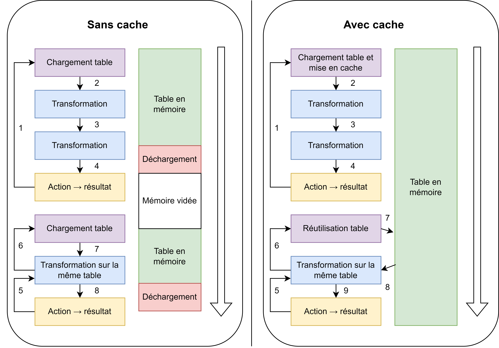

# 📝 Utiliser le cache pour améliorer ses calculs

Un cache est un espace de stockage temporaire dans lequel on place des objets dont on souhaite se resservir plus tard, afin de ne pas avoir à les recalculer. Ces objets ne sont pas suffisamment importants pour justifier une persistance complète sur disque, car ce ne sont pas des résultats finaux.

## Principe de fonctionnement

<figure><figcaption></figcaption></figure>

Ce schéma montre la différence entre un fonctionnement de Spark en utilisant le cache et sans le cache. À gauche, la chaine d'exécution est déclenchée en 1 par la présence de l'action (un `show` ou un `count` par exemple). Cette chaine implique la montée en mémoire de la table. Pendant le temps où le calcul demandé par l'action est en traitement, la table est bien en mémoire. Elle est cependant déchargée à la fin de 4 pour libérer la mémoire et continuer le programme.&#x20;

Si on appelle la même table par la suite, Spark effectue de nouveau le bloc de chargement. Il a connaissance du nom de la table bien sûr, mais il doit exécuter de nouveau le bloc de chargement puisque cette table n'est plus en mémoire. Dans le code, même si on ne fait pas deux fois l'instruction read\_csv, celle-ci est en pratique jouée deux fois afin de construire la table quand c'est nécessaire.

C'est ici que la différence intervient avec la situation avec cache. Dans le schéma de droite, la table est mise en cache après le chargement et donc reste en mémoire pour la durée de la session. Elle est donc réutilisée sans coût lors de l'appel d'une transformation après une action (5-6). C'est donc plus rapide.&#x20;

### Avantages et inconvénients

Dans le premier exemple, sans cache, le chargement est effectué 2 fois, donc le temps utilisé est plus long. En effet, puisqu'il s'agit de la même table, c'est intéressant de la mettre en cache. On peut donc dire que lorsqu'une table sera appelée plusieurs fois dans le code, après plusieurs actions qui produisent des résultats, c'est intéressant de la mettre en cache.&#x20;

Ce n'est pas le cas si on va enchainer les transformations et ne produire qu'un seul résultat : dans ce cas, on ne gagnera pas de temps de chargement, et la table restera dans la mémoire pour l'ensemble de la session. Cela prive donc la suite des calculs de ressources utiles en stockant dans la mémoire une table de façon inutile.

## Applications

### Chargement des tables

La première application de la mise en cache est évidemment lors du chargement des tables comme dans l'exemple ci-dessus.

Avec l'instruction `spark_read_csv` de sparklyr par exemple, on peut utiliser l'option memory = TRUE / FALSE. Cette option charge la table en mémoire dans un cas, alors que dans l'autre, elle va simplement créer un lien logique entre le nom de la table et le fichier, sans effectuer de chargement.&#x20;

Autrement, avec PySpark, il faut utiliser `.cache()` qui permet d'obtenir le même résultat.

### Utiliser un cache ou [HDFS](../../../clusters/hdfs.md) pour stocker un résultat intermédiaire

Pour éviter le recalcul de certains résultats, utiliser un cache ou stocker le résultat est une option envisageable lorsque beaucoup de calculs sont effectués. Il est possible d'appliquer la même stratégie qu'au chargement des tables, mais sur un DataFrame qui a déjà été modifié, en le mettant en cache.

Attention cependant à l'abus d'utilisation du cache : cette opération ne doit être utilisée que dans un objectif d'optimisation, pas de façon systématique après chaque calcul, sous peine de consommer l'ensemble de la mémoire sans gain de vitesse. En particulier, il ne faut pas mettre en cache un jeu de données qui ne tient pas en mémoire.

Les ressources concernant la mise en cache avec Sparklyr sont disponibles ici :



Ici, la documentation de la fonction PySpark pour mettre en cache :


