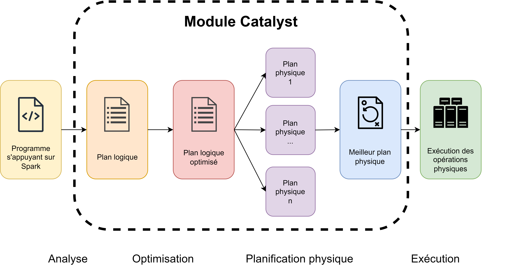
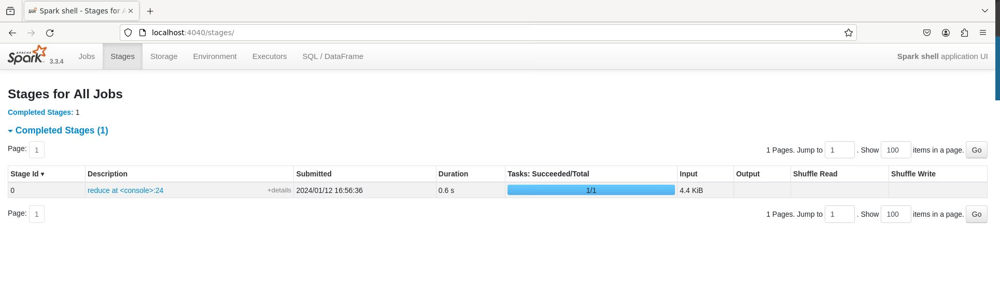
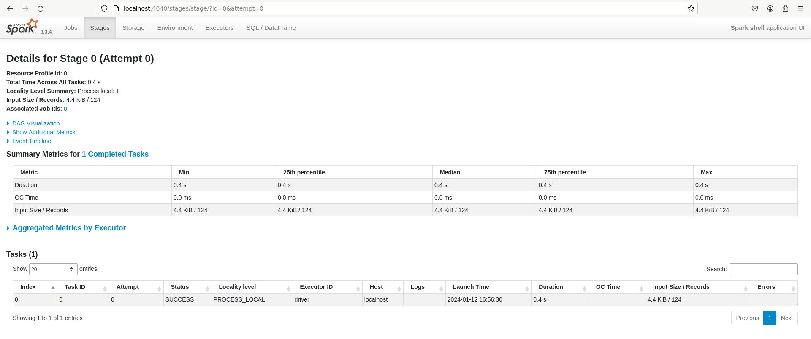
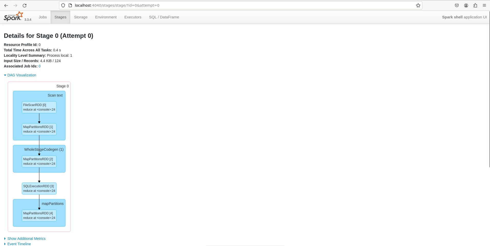

# 💣 Les plans d'exécutions et Catalyst

## Qu'est-ce qu'un plan d'exécution Spark ?

Lorsque vous faites exécuter un programme, Spark interprète votre code pour tenter d'optimiser sa réalisation. C'est le plan d'exécution. C'est-à-dire, la suite d'opérations logiques ou physiques que Spark doit effectuer pour obtenir le résultat des transformations demandées sur les données. Le module chargé de cette optimisation se nomme Catalyst. Il est une des raisons historiques du succès de Spark : il apporte une optimisation extrême qui rend les programmes Spark très rapides à exécuter.

Schématiquement, les choses sont organisées de la manière suivante :&#x20;

<figure><figcaption><p>Optimisation du code Spark par le module Catalyst de Spark</p></figcaption></figure>

D'abord, le programme est analysé, afin de comprendre la suite d'opérations voulues par l'utilisateur. Ensuite, on peut optimiser ce plan logique, par exemple, en filtrant d'abord les lignes avant une jointure, pour effectuer le moins d'opérations possibles.

Une fois le plan meilleur plan logique déterminé, on peut générer plusieurs plans physiques pour le réaliser. Ces plans sont alors évalués par un modèle de coût qui permet de déterminer quel plan physique est le moins couteux. Les opérations peuvent alors débuter.

## Pourquoi s'intéresser aux plans et les optimiser ?

Malgré l'excellence technique de Catalyst, il n'est pas encore capable d'optimiser complètement un code. Il est donc possible d'aider ce module en utilisant des techniques dans notre programme Spark. Comprendre le fonctionnement des plans générés par ce module est essentiel pour comprendre comment écrire un programme Spark qui sera bien optimisé.&#x20;

Lorsque l'on mobilise un programme Spark, surtout sur Cluster, il est fréquent que cela provoque du shuffling. C'est-à-dire, le mouvement de données entre plusieurs nœuds de notre cluster de calcul, pour que ces nœuds puissent effectuer le calcul qui leur a été affecté. Ces opérations sont très couteuses en temps. On cherche donc à limiter ces opérations. On peut voir ces opérations dans les plans d'exécution de Spark, et comprendre ce qui les a causés. **L'enjeu des plans d'exécution, c'est donc de diminuer le temps nécessaire pour obtenir un résultat identique avec la même quantité de données et les mêmes ressources.**&#x20;

## Trouver son plan d'exécution

Le plan d'exécution associé à un job/à une commande Spark est toujours disponible sur Spark UI, l'interface graphique accessible depuis le navigateur.  Cela permet d'obtenir des statistiques sur l'utilisation des ressources étapes par étapes.&#x20;

Voici comment trouver le plan associé à la suite de commandes issues de la documentation Spark (il s'agit d'instructions Scala, mais la technique reste valable avec SparklyR ou Pyspark !) :&#x20;

```scala
val textFile = spark.read.textFile("README.md")

textFile.map(line => line.split(" ").size).reduce((a, b) => if (a > b) a else b)
```

Cette suite de commande compte le nombre de lignes du fichier readme.md de spark de façon distribuée. Voyons comment obtenir le plan (DAG) associé à cette commande :&#x20;

D'abord, on liste les étapes des Jobs dans l'onglet stages

<figure><figcaption></figcaption></figure>

Ensuite, on ouvre la commande exécutée :

<figure><figcaption></figcaption></figure>

Enfin, on obtient le schéma qui représente le DAG en cliquant sur DAG Visualization :

<figure><figcaption><p>Enfin, le DAG (plan d'exécution) est disponible en cliquant sur DAG vizualisation</p></figcaption></figure>

Les plans d'exécutions sont différenciés selon le mode local ou cluster. En particulier le plan physique retenu. En local, toutes les opérations se font sur la même machine, il n'y a donc pas la phase de négociations de ressources présente dans un cluster managé avec Yarn par exemple. Les plans locaux sont donc généralement plus faciles à lire pour un débutant puisqu'ils mobilisent moins d'étapes.

## Comprendre le fonctionnement de Catalyst

Un des objectifs principaux de Catalyst est de préparer un plan d'exécution qui évite les mouvements de données entre les nœuds en mode cluster (c'est le shuffling). Cette étape est extrêmement couteuse et différentes techniques existent pour l'éviter. De plus, Spark effectue des traitements en parallèle, même en mode local, via les différents cœurs du processeur. Par conséquent, le plan préparé doit pouvoir être distribué au mieux. Pour cela, il est possible d'utiliser les techniques présentées dans la suite de cette section.

## Techniques utilisées par Catalyst pour optimiser le code

Nous allons voir quatre techniques majeures utilisées par le module Catalyst pour optimiser les traitements Spark. Cela nous permettra par la suite de comprendre comment optimiser notre code Spark, en fonction de ce que l'on lit dans le diagramme DAG présenté précédemment.

### Le pipelining

Dans une étape, si plusieurs transformations sont de type Narrow, elles peuvent être misent dans un pipeline. C'est-à-dire, être enchainées par Spark sans mouvements de données. Par exemple, l'application d'un filtre, puis d'une Union entre deux tables. Lors d'un pipeline, Spark est capable d'identifier les dépendances (partitions) d'un tableau, et donc d'enchaîner les étapes dès que les résultats sont disponibles, sans attendre l'ensemble des résultats pour toutes les partitions.

Des opérations qui font l'objet d'un pipeline sont donc moins couteuses à exécuter. Cela se matérialise dans le DAG par l'enchainement de ces étapes en un seul bloc.

### La concurrence des étapes

Spark est nativement distribué. Cela signifie qu'il exécute plusieurs tâches en parallèle. Ceci est possible lorsque les différentes transformations ne sont pas reliées entre elles. La concurrence exécute de façon parallèle différentes étapes indépendantes. Cela se produit en particulier lorsqu'il n'est pas nécessaire d'attendre le résultat d'une transformation précédente pour démarrer les calculs de la transformation suivante.\
\
Par exemple : si un pipeline est défini et est exécuté sur chaque nœud de calcul, inutile d'attendre le résultat de l'étape intermédiaire sur le nœud 2 pour calculer la suite des opérations du nœud 1 si sa propre opération intermédiaire est achevée. On peut poursuivre les opérations du pipeline sur le nœud 1.

### La fusion de tâches consécutives

Il s'agit d'une technique proche du pipelining. Lorsque plusieurs tâches peuvent être fondues en une seule, Spark les exécute en même temps afin de gagner du temps. C'est une étape supplémentaire par rapport au pipeline, lorsqu'il est possible d'effectuer deux traitements en même temps et non plus à la suite. Cela permet de faire des gains de temps non négligeables en ne dupliquant pas certains calculs.

Par exemple, deux filtres appliqués sur deux variables différentes à la suite sur une table peuvent être fusionnés et seront exécutés ensemble.

### La data locality

Spark exécute prioritairement les traitements là où les données sont déjà présentes. Là encore, l'objectif est de minimiser les mouvements de données. Cette priorisation est prise en compte lors de la planification par le module Catalyst. Le partitionnement des tables sur les nœuds de données est un élément particulièrement important pour bénéficier de cette technique. Si une table est bien partitionnée, il est possible de minimiser grandement les mouvements de données entre les nœuds, même lors d'un group by !

L'objectif de cette technique est encore d'éviter les mouvements de données (shuffle).
