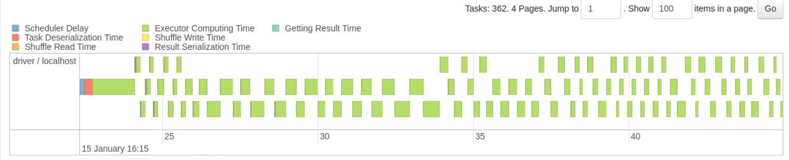

# 👩🏫 Lire et optimiser un plan d'exécution Spark

**Attention :** cet article présente des notions avancées en Spark. Ces notions ne sont pas nécessaires pour faire fonctionner le logiciel : il est tout à fait possible de faire du Spark sans elles. Il s'agit d'optimisations pour les personnes qui effectuent du Spark en production, et pour qui le temps d'exécution d'un programme doit être diminué. \
\
Cet article n'est pas recommandé pour les débutants en Spark, même s'il peut être lu par tous.

## Qu'est-ce qu'un plan d'exécution Spark ?

Lorsque vous faites exécuter un programme, Spark interprète votre code pour tenter d'optimiser sa réalisation. C'est le plan d'exécution. C'est-à-dire, la suite d'opérations logiques ou physiques que Spark doit effectuer pour obtenir le résultat des transformations demandées sur les données. Le module chargé de cette optimisation se nomme Catalyst. Il est une des raisons historiques du succès de Spark : il apporte une optimisation extrême qui rend les programmes Spark très rapides à exécuter.

Schématiquement, les choses sont organisées de la manière suivante :&#x20;

<figure><figcaption><p>Optimisation du code Spark par le module Catalyst de Spark</p></figcaption></figure>

D'abord, le programme est analysé, afin de comprendre la suite d'opérations voulues par l'utilisateur. Ensuite, on peut optimiser ce plan logique, par exemple, en filtrant d'abord les lignes avant une jointure, pour effectuer le moins d'opérations possibles.

Une fois le plan meilleur plan logique déterminé, on peut générer plusieurs plans physiques pour le réaliser. Ces plans sont alors évalués par un modèle de coût qui permet de déterminer quel plan physique est le moins couteux. Les opérations peuvent alors débuter.

## Pourquoi s'intéresser aux plans et les optimiser ?

Malgré l'excellence technique de Catalyst, il n'est pas encore capable d'optimiser complètement un code. Il est donc possible d'aider ce module en utilisant des techniques dans notre programme Spark. Comprendre le fonctionnement des plans générés par ce module est essentiel pour comprendre comment écrire un programme Spark qui sera bien optimisé.&#x20;

Lorsque l'on mobilise un programme Spark, surtout sur Cluster, il est fréquent que cela provoque du shuffling. C'est-à-dire, le mouvement de données entre plusieurs nœuds de notre cluster de calcul, pour que ces nœuds puissent effectuer le calcul qui leur a été affecté. Ces opérations sont très couteuses en temps. On cherche donc à limiter ces opérations. On peut voir ces opérations dans les plans d'exécution de Spark, et comprendre ce qui les a causés. **L'enjeu des plans d'exécution, c'est donc de diminuer le temps nécessaire pour obtenir un résultat identique avec la même quantité de données et les mêmes ressources.**&#x20;

## Trouver son plan d'exécution

Le plan d'exécution associé à un job/à une commande Spark est toujours disponible sur Spark UI, l'interface graphique accessible depuis le navigateur.  Cela permet d'obtenir des statistiques sur l'utilisation des ressources étapes par étapes.&#x20;

Voici comment trouver le plan associé à la suite de commandes issues de la documentation Spark (il s'agit d'instructions Scala, mais la technique reste valable avec SparklyR ou Pyspark !) :&#x20;

```scala
val textFile = spark.read.textFile("README.md")

textFile.map(line => line.split(" ").size).reduce((a, b) => if (a > b) a else b)
```

Cette suite de commande compte le nombre de lignes du fichier readme.md de spark de façon distribuée. Voyons comment obtenir le plan (DAG) associé à cette commande :&#x20;

D'abord, on liste les étapes des Jobs dans l'onglet stages

<figure><figcaption></figcaption></figure>

Ensuite, on ouvre la commande exécutée :

<figure><figcaption></figcaption></figure>

Enfin, on obtient le schéma qui représente le DAG en cliquant sur DAG Visualization :

<figure><figcaption><p>Enfin, le DAG (plan d'exécution) est disponible en cliquant sur DAG vizualisation</p></figcaption></figure>

Les plans d'exécutions sont différenciés selon le mode local ou cluster. En particulier le plan physique retenu. En local, toutes les opérations se font sur la même machine, il n'y a donc pas la phase de négociations de ressources présente dans un cluster managé avec Yarn par exemple. Les plans locaux sont donc généralement plus faciles à lire pour un débutant puisqu'ils mobilisent moins d'étapes.

## Optimisations au code Spark et fonctionnement de Catalyst

Un des objectifs principaux de Catalyst est de préparer un plan d'exécution qui évite les mouvements de données entre les nœuds en mode cluster (c'est le shuffling). Cette étape est extrêmement couteuse et différentes techniques existent pour l'éviter. De plus, Spark effectue des traitements en parallèle, même en mode local, via les différents cœurs du processeur. Par conséquent, le plan préparé doit pouvoir être distribué au mieux.

Un rappel préalable : Spark différencie les transformations et les actions. Une transformation prend un tableau en entrée, et retourne un autre tableau. Une action prend un tableau en entrée et retourne autre chose qu'un tableau. \
Cette différence est très importante à cause du phénomène de lazy evaluation. Comme nous l'avons vu, Catalyst optimise le code en réorganisant les étapes. Cela ne peut être fait que lorsque l'on exécute plusieurs lignes à la fois. Par conséquent, Spark attend qu'une action (show, write, collect, count, ...), soit déclenchée afin d'effectuer les traitements. C'est pour cela que faire un groupBy est instantané dans une cellule de Jupyter Notebook, mais qu'afficher le résultat avec un show dans une autre cellule ne l'est pas : Spark exécute physiquement l'instruction groupBy au moment de l'activation de la cellule d'affichage.\
\
Nous allons voir cinq techniques majeures utilisées par le module Catalyst pour optimiser les traitements Spark. Cela nous permettra par la suite de comprendre comment optimiser notre code Spark, en fonction de ce que l'on lit dans le diagramme DAG présenté précédemment.

### Dépendances Narrow contre Wide

Spark introduit la notion de dépendance entre deux tableaux pour les transformations qu'il propose. Il en existe deux types : Narrow et Wide. On dit d'une transformation qu'elle possède une dépendance Narrow si chaque partition du résultat dépend d'une partition de l'entrée. À l'inverse, une transformation possède des dépendances Wide si les partitions du résultat possèdent des données de différentes partitions d'origine. Observez plutôt le schéma suivant :&#x20;

<figure><figcaption></figcaption></figure>

Les transformations Spark dites de type Narrow sont en autres :

* Union
* Map
* Filter
* Certaines jointures lorsque les données sont partitionnées selon leurs clés.

Par exemple, lors d'un filtre, on peut appliquer le filtre aux données de chaque nœud. Il est inutile de mobiliser des données de plusieurs nœuds pour cette opération. Cela correspond au fonctionnement à gauche du schéma.

Ce n'est pas le cas pour :&#x20;

* GroupBy
* Repartition
* Intersection
* Distinct
* Join

Ces transformations sont de type wide. Par conséquent, lorsque vous les appliquez, elles forcent presque systématiquement des mouvements de données. Par exemple, dans le cas d'un GroupBy, il est bien nécessaire d'utiliser les données des différents nœuds afin d'effectuer les groupements demandés. Il y a donc shuffling.

Les opérations de type Narrow peuvent être facilement enchainées, réparties sur différents nœuds, et sont donc moins couteuses. Ce n'est pas le cas des opérations wide.

### Le pipelining

Dans une étape, si plusieurs transformations sont de type Narrow, elles peuvent être misent dans un pipeline. C'est-à-dire, être enchainées par Spark sans mouvements de données. Par exemple, l'application d'un filtre, puis d'une Union entre deux tables. Lors d'un pipeline, Spark est capable d'identifier les dépendances (partitions) d'un tableau, et donc d'enchaîner les étapes dès que les résultats sont disponibles, sans attendre l'ensemble des résultats pour toutes les partitions.

\[Image d'instructions ayant fait l'objet d'un pipeline]

Des opérations qui font l'objet d'un pipeline sont donc moins couteuses à exécuter. Cela se matérialise dans le DAG par l'enchainement de ces étapes en un seul bloc.

### La concurrence des étapes

Spark est nativement distribué. Cela signifie qu'il exécute plusieurs tâches en parallèle. Ceci est possible lorsque les différentes transformations ne sont pas reliées entre elles. La concurrence exécute de façon parallèle différentes étapes indépendantes. Cela se produit en particulier lorsqu'il n'est pas nécessaire d'attendre le résultat d'une transformation précédente pour démarrer les calculs de la transformation suivante.\
\
Par exemple : si un pipeline est défini et est exécuté sur chaque noeud de calcul, inutile d'attendre le résultat de l'étape intermédiaire sur le noeud 2 pour calculer la suite des opérations du noeud 1 si ca propre opération intermédiaire est achevée. On peut poursuivre les opérations du pipeline sur le noeud 1.

### La fusion de tâches consécutives

Il s'agit d'une technique proche du pipelining. Lorsque plusieurs tâches peuvent être fondues en une seule, Spark les exécute en même temps afin de gagner du temps. C'est une étape supplémentaire par rapport au pipeline, lorsqu'il est possible d'effectuer deux traitements en même temps et non plus à la suite. Cela permet de faire des gains de temps non négligeables en ne dupliquant pas certains calculs.

Par exemple, deux filtres appliqués sur deux variables différentes à la suite sur une table peuvent être fusionnés et seront exécutés ensemble.

### La data locality

Spark exécute prioritairement les traitements là où les données sont déjà présentes. Là encore, l'objectif est de minimiser les mouvements de données. Cette priorisation est prise en compte lors de la planification par le module Catalyst. Le partitionnement des tables sur les noeuds de données est un élément particulièrement important pour bénéficier de cette technique.

L'objectif de cette technique est encore d'éviter les mouvements de données (shuffle).

## Comment aider Catalyst dans votre code et gagner du temps ?

Nous avons vu les techniques avancées que Catalyst met en place pour optimiser les temps de calculs. Voyons maintenant comment nous pouvons en tirer profit par un code optimal en tenant compte du comportement de ce module.&#x20;

### Étape 1 : Détecter les engorgements via le diagramme DAG

Nous avons appris où lire un diagramme DAG précédemment. Ce que l'on recherche dans ce diagramme sont les engorgements. C'est-à-dire, les étapes qui provoquent un ralentissement en bloquant l'ensemble du code. Cela se matérialise souvent par la présence d'un shuffle, qui sont souvent la conséquence d'une instruction de nature Wide :

<figure><figcaption></figcaption></figure>

Ici, on voir que l'engorgement se fait au moment où l'on passe de l'étape 8 à 9, car il y a lecture et écriture de 58 Giga de données entre les deux étapes. C'est à dire, transfert de données.&#x20;

On peut aussi regarder quelles sont les étapes qui consomment le plus de temps (de CPU et de RAM dans le tableau en dessous également). Cet exemple de Apache Spark montre les étapes du calcul de Pi :

<figure><figcaption></figcaption></figure>

On peut alors déterminer dans notre code ce qui est responsable de la durée du traitement. On peut ensuite prendre une décision adaptée en apportant des modifications.

### Étape 2 : Utiliser une technique pour optimiser

Il existe différentes techniques afin d'optimiser son code, à adapter selon la cause de l'engorgement détectée à l'étape 1. Parmis celles-ci, on trouve, entre autres :&#x20;

#### Le choix de la [stratégie de jointure](https://spark.apache.org/docs/latest/sql-performance-tuning.html#join-strategy-hints-for-sql-queries)

Selon la taille des tables à joindre par rapport à la mémoire, on peut indiquer à Spark une certaine technique de jointure plus ou moins adaptée :&#x20;

1 - Broadcast Hash Join  : si une des tables est petite et l'autre grande, c'est un bon choix. Attention : elle ne supporte que le critère d'égalité pour la jointure.

2 - Sort Merge Join : cette stratégie est efficace en toute circonstances de taille : elle est prévue pour déborder sur le disque car elle n'utilise pas de table de hashache. \
Attention : elle ne supporte que le critère d'égalité pour la jointure.

3 - Shuffle Hash Join : si les deux tables sont grandes, cette stratégie est envisageable car elle mélange le hashage et le shuffling. \
Attention : elle ne supporte que le critère d'égalité pour la jointure et peut ne pas fonctionner si la taille dépasse la mémoire allouée au traitement.

4 - Broadcast Nested Loop Join : cette stratégie est intéressante car elle offre la possibilité de joindre avec un critère < ou >. Ce n'est pas possible avec les algorithmes précédents. \
Attention : Il s'agit de la stratégie la moins rapide, même dans un cas d'égalité. Elle fait une comparaison totale dans tous les cas afin de supporter des critères de jointures particuliers.

5 - Cartesian Product Join : Il s'agit de la jointure naïve. Elle est presque systématiquement à éviter. Elle résulte souvent dans des erreurs mémoires, même avec des tables de taille moyenne. &#x20;

Spark choisit lui même une stratégie 'adaptée' en fonction de paramètres par défauts, mais on peut forcer la stratégie pour gagner du temps si celle choisie ne nous correspond pas à ce que l'on souhaite faire.

#### Le [repartitionnement d'une table](https://spark.apache.org/docs/3.1.3/api/python/reference/api/pyspark.sql.DataFrame.repartition.html) si celle-ci est mal partitionnée

Dans l'exemple cité en étape 1 : on pourrait envisager de repartionner la table avec un nombre de partitions inférieures, afin de profiter de plus de data locality, et avoir un shuffling moins important

En règle générale, le nombre de partition d'une table doit être contenue entre :&#x20;

Au minimum : 2 x le nombre de cœurs choisis pour l’application

Au maximum : au moins 100ms de temps d'exécution par partition, au dela, c'est que la table est trop partitionnée, et donc on perds du temps lors des opérations qui nécéssitent un shuffling.

#### L'adaptation des ressources ([En R](8\_spark\_usage.md#configurer-spark-en-mode-local) / [En Python](utiliser-spark-avec-python.md#configurer-spark-en-mode-local)) allouées au traitement

Dans certains cas, les données dépassent la taille de la mémoire allouée au traitement. S'il est posssible de le faire, on peut envisager l'augmentation de la mémoire pour que l'ensemble des données soient chargées en mémoire. Sinon, cela provoque la montée et descente intempestive de données entre disque et mémoire pour que les données puissent être lues par Spark. Ce n'est pas optimal.

#### Eviter d'utiliser un collect&#x20;

L'instruction collect sur une trop grande quantité de données provoque de grands déplacements de données. Ce n'est pas souvent efficace. Par conséquent, si on souhaite vraiment visualiser le résultat, il est préférable d'afficher les 5 premières lignes de la table, ce qui est nettement moins consommateur de ressources et de temps.

#### Utiliser un cache ou [HDFS](../gestion-des-clusters/gestion-des-donnees-avec-hdfs.md) pour stocker un résultat intermédiaire

Pour éviter le recalcul de certains résultats, utiliser un cache ou stocker le résultat est une option envisageable lorsque beaucoup de calculs sont effectués. Attention cependant à l'abus d'utilisation du cache : cette opération ne doit être utilisée que dans un objectif d'optimisation, pas de façon systématique après chaque calcul, sous peine de consommer l'ensemble de la mémoire sans gain de vitesse. En particulier, il ne faut pas mettre en cache un jeu de données qui ne tient pas en mémoire.

### Étape 3 : Comparer avec ou sans l'optimisation

Une fois votre stratégie d'optimisation définie, vous pouvez effectuer un benchmark pour comparer si la stratégie d'optimisation a permis de réduire le temps de calcul. En utilisant le Spark UI, vous pouvez obtenir la durée de traitement ou alors définir dans votre code des balises de temps pour mesurer la durée d'une fonction :&#x20;

En pyspark :

```python
from pyspark.sql import SparkSession
import time

def my_spark_function():
    spark = SparkSession.builder.appName("mon_application").getOrCreate()
    
    # Transformations
    df = spark.read.csv("chemin/vers/votre/fichier.csv", header=True, inferSchema=True)
    result_df = df.groupBy("colonne").count()
    
    # Action
    result_df.show()

start_time = time.time()
my_spark_function()
end_time = time.time()
duration = end_time - start_time

# Affichez la durée
print(f"La fonction Spark a mis {duration} secondes pour s'exécuter.")
```

En SparklyR :&#x20;

```r
library(sparklyr)
library(dplyr)
library(SparkR)
library(SparkR::sparklyr)

my_spark_function <- function() {
  spark <- spark_connect(master = "local", version = "3.0.2")
  
  # Traitement
  df <- spark_read_csv(spark, "chemin/vers/votre/fichier.csv", header = TRUE, infer_schema = TRUE)
  result_df <- df %>% group_by(colonne) %>% summarize(count = n())

  # Action
  spark_print(result_df)
}

start_time <- Sys.time()
my_spark_function()
end_time <- Sys.time()

duration <- end_time - start_time

cat(paste("La fonction Spark a mis", as.numeric(duration), "secondes pour s'exécuter.\n"))
```
