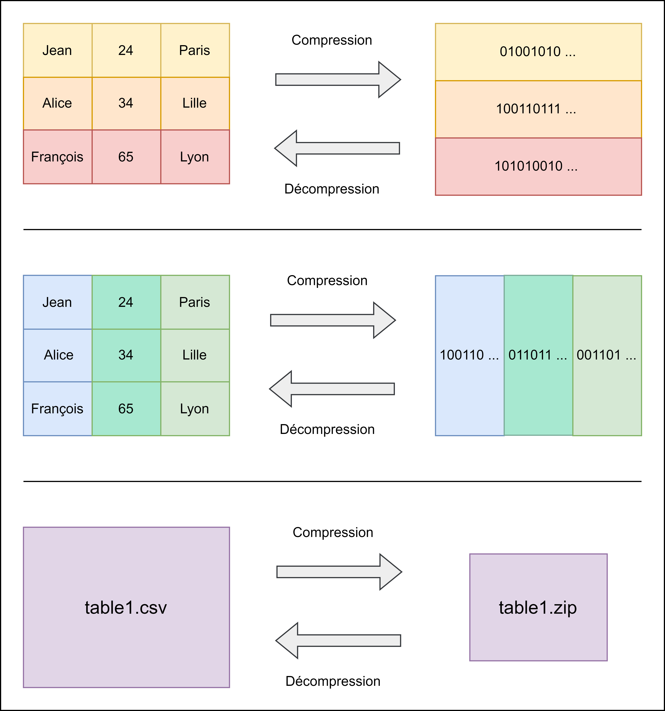

# 👩‍🏫 Choisir son format de fichier

Différents formats de fichiers sont disponibles au CASD et compatibles avec les logiciels proposés. Choisir le bon format de fichier pour stocker vos données est critique, car les conversions sont couteuses. De plus, les différents formats de stockage n'offrent pas les mêmes performances de calculs, et n'occupent pas la même place sur disque.

## Les critères

### Structuré contre non structuré 

Un premier choix doit être opéré dans la structuration ou non des données. Le fait de structurer les données, c'est choisir, ou non, un modèle que les données doivent suivre avant d'être stockées.

Par exemple : une base de données SQL est très structurée. Le format est imposé jusqu'à la taille de chaque attribut d'une table. De même, un fichier Excel est aussi structuré, car il possède des contrôles sur les colonnes et les formats. Les avantages d'un fichier structuré sont le contrôle des informations présentes en termes de format.

À l'inverse : un fichier texte n'est pas structuré. Il est possible d'écrire les informations sans contraintes.&#x20;

Enfin, il existe aussi des formats de fichiers semi-structurés. Il s'agit d'une solution intermédiaire comme le CSV ou le JSON, qui implémente certains aspects des fichiers structurés. En général, on peut les reconnaitre grâce aux balises ou séparateurs.&#x20;

### Compression 

La compression d'un fichier détermine une partie de sa capacité à stocker un volume important de données avec une taille raisonnable. Le principe est d'utiliser un algorithme afin de [transformer une suite de bits en une autre suite de plus petite taille](https://fr.wikipedia.org/wiki/Compression\_de\_donn%C3%A9es). Lorsque l'on va ensuite lire les données, ou les réutiliser, il faudra effectuer l'opération inverse : la décompression. Ce principe général peut s'appliquer aux fichiers ou aux images par exemple (avec pertes parfois, c'est ce qui se produit lors de l'envoi d'une photo d'un téléphone à un autre par une application de messagerie !). Voici le principe de la compression pour les fichiers contenant des données. Il s'agit d'une application très précise d'une théorie bien plus générale qui permet de compresser de l'information afin de diminuer sa taille.

En général, la compression est plus efficace si les données à compresser sont uniformes et de grandes tailles.&#x20;

Il existe différente façon de compresser un fichier :&#x20;

* Ligne par ligne
* Colonne par colonne
* À l'échelle entière du fichier

Observez plutôt le schéma ci-dessous :&#x20;

<figure><figcaption></figcaption></figure>

Les trois techniques de compression sont représentées.&#x20;

D'abord, en ligne par ligne, on constate que les données d'une ligne sont regroupées puis transformées. Cela présente l'avantage que l'on peut accéder aux données d'une ligne et ne décompresser que cette ligne pour accéder aux données contenues. L'inconvénient est que cette compression est souvent peu efficace due à la diversité des données stockées sur une même ligne, et de la faible quantité de donnée à compresser. Il y a donc peu d'optimisations possibles. Ce type de compression est très adapté pour le transactionnel (lecture / écriture) mais peu efficace en analyse. C'est le type de compression utilisé en SAS.

Dans le second cas, en compressant par colonne, on conserve l'avantage de l'utilisation en ne décompressant que les colonnes utiles dans notre calcul (si le logiciel le supporte !). De plus, la compression est généralement très forte, car les données d'une colonne sont généralement uniformes. En effet, compresser une colonne d'ages ou de texte est bien plus facile que de compresser deux chaines de caractères et un entier par exemple. Cependant, les données associées à une unité ne sont plus stockées ensemble ! Cela signifie qu'accéder aux informations d'Alice ou de François est plus couteux qu'avec la compression ligne. Cette compression est donc à dédier aux calculs mobilisant les données d'une colonne plutôt qu'à l'accès unité par unité. C'est un usage analyse, de lecture intensive, mais pas du tout adapté à l'écriture. C'est le type de compression choisi par Parquet.&#x20;

Dans le dernier cas, en compressant le fichier entier, on perd la possibilité de l'utiliser sans décompression. Par conséquent, ce type de compression est à réserver au transport/stockage de fichier. Si on décompresse un fichier compressé de cette manière, il reprend sa taille originale. L'objectif n'est donc pas du tout le même. C'est ce qui se produit lorsque l'on zippe et dézippe un fichier afin de l'envoyer.

### Acceptation par les logiciels

Selon l'utilisation et l'objectif poursuivi avec les données manipulées, le choix du format de fichier peut également varier. Si les données sont traitées exclusivement avec Excel ou SAS, le fait que les formats soient propriétaires n'est pas un problème. Dans les autres cas, il est toujours préférable de choisir un format interopérable afin d'assurer la portabilité des traitements sans avoir à convertir toutes les données.&#x20;

Le CSV, Parquet et JSON sont interopérables, c'est-à-dire qu'ils ne sont pas attachés à un logiciel ou un éditeur.

### Possibilité de partitionner

Le partitionnement est la possibilité de découper une table en sous tables de plus petite taille pour gagner du temps de traitement. Il est expliqué en détail dans [cet article sur Spark.](../spark/dag/boite-a-outil-des-optimisations/partitionner-une-table-selon-une-variable.md) Cela peut être un critère pour les traitements sur grands volumes de données arrêtés. Dans ce cas, Parquet semble de toute manière le format le plus adapté.&#x20;

## Les formats

Voici une table qui présente une évaluation subjective du support de certaines des propriétés présentées dans cet article par 5 des formats les plus populaires :

<table data-full-width="false"><thead><tr><th width="220">Propriété</th><th width="83" align="center">CSV</th><th width="93" align="center">Parquet</th><th width="85" align="center">JSON</th><th width="121" align="center">SAS7BDAT</th><th align="center">XLSX (excel)</th></tr></thead><tbody><tr><td>Support des logiciels</td><td align="center">+++</td><td align="center">++</td><td align="center">+</td><td align="center">Propriétaire</td><td align="center">Propriétaire</td></tr><tr><td>Modification des cellules</td><td align="center">+</td><td align="center">-</td><td align="center">+</td><td align="center">+</td><td align="center">+</td></tr><tr><td>Schéma et structure complexes</td><td align="center">-</td><td align="center">+</td><td align="center">+</td><td align="center">+</td><td align="center">-</td></tr><tr><td>Support des métadonnées</td><td align="center">-</td><td align="center">+</td><td align="center">-</td><td align="center">+</td><td align="center">+</td></tr><tr><td>Compression</td><td align="center">Fichier</td><td align="center">Colonne</td><td align="center">Fichier</td><td align="center">Ligne</td><td align="center">Fichier</td></tr><tr><td>Partitionnable</td><td align="center">+</td><td align="center">++</td><td align="center">-</td><td align="center">-</td><td align="center">-</td></tr></tbody></table>

Il n'y a pas de format parfait, il faut choisir le format qui présente le plus d'avantages et le moins d'inconvénient pour le cas d'usage ciblé.
